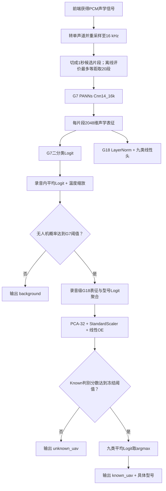
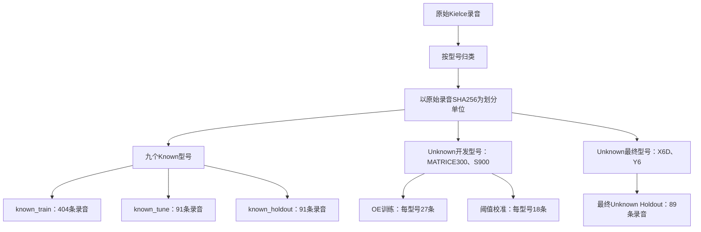
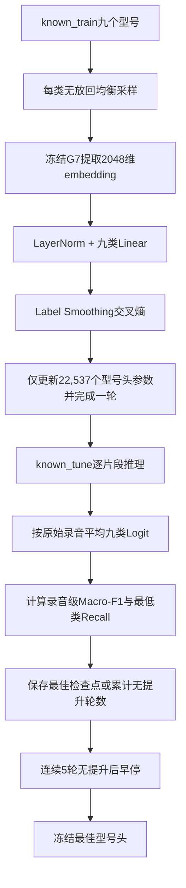
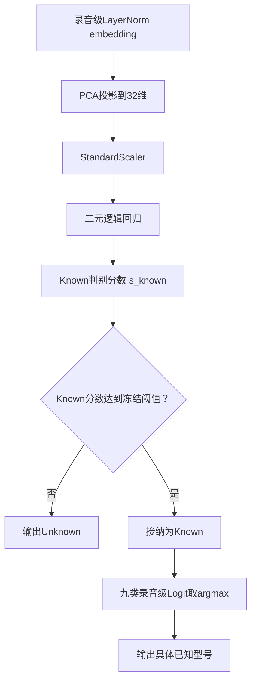
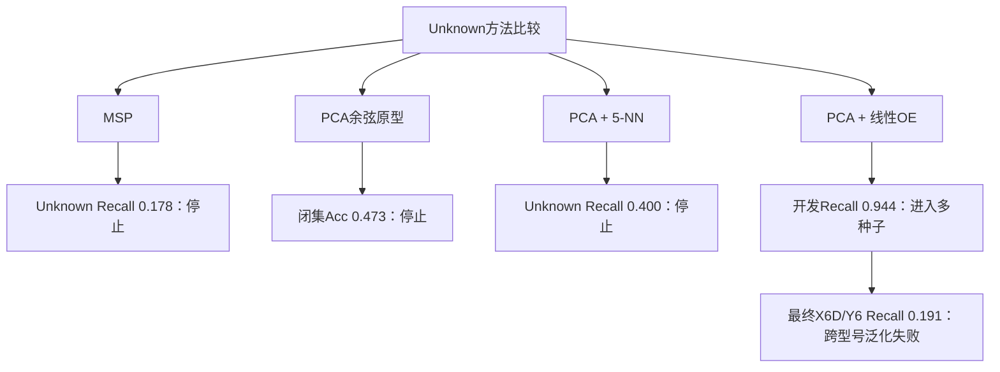
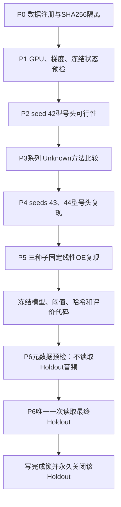
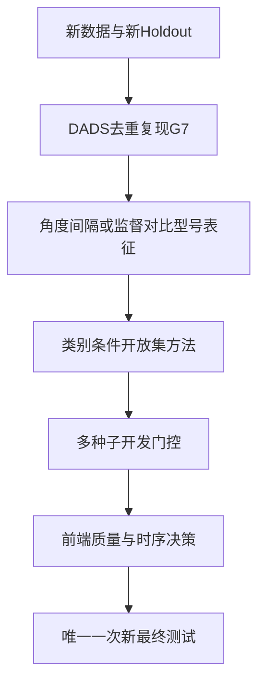

# G18方法原理与完整流程说明

更新日期：2026年7月26日

本文说明“声学无人机检测与开放集型号识别系统”当前G7无人机检测与G18开放集型号
识别实际使用的方法、训练方式、推理规则和评估协议。文中的“当前实现”均以工程代码
和冻结配置为准，
不把尚未实现的设想写成现有能力。

`ABDDV-CRNN`仅作为历史仓库目录、Python入口和早期CRNN复现实验的兼容名称保留，
不表示当前正式检测器仍采用CRNN。

---

## 1. 系统任务与完整链路

系统将声学识别拆成三个连续问题：

1. 输入中是否存在无人机声学信号；
2. 若存在无人机，它是否属于训练时见过的九个型号；
3. 若属于已知型号，具体是哪一个型号。

最终输出为以下三种状态之一：

- `background`：未达到G7无人机检测阈值；
- `unknown_uav`：G7判定为无人机，但开放集模块认为它不属于九个已知型号；
- `known_uav + model_id`：G7判定为无人机，开放集模块接纳并输出具体型号。



工程目前没有独立训练完成的“信号质量与有效性检测模型”。解码失败、波形长度、有限
数值和哈希一致性检查已经实现；低信噪比、削波、丢帧等质量评分仍是后续工程化模块。

---

## 2. 数据预处理与隔离

### 2.1 数据来源及其角色

当前系统使用的数据不是全部混在一起训练，而是按任务和生命周期严格区分。

| 数据 | 内容 | 当前用途 | 是否更新模型权重 |
|---|---|---|---|
| AudioSet预训练权重 | 527类通用声音监督知识 | 初始化PANNs声学骨干 | 仅作为预训练起点 |
| DADS | 无人机/背景二分类音频 | G7训练、验证及历史同源内部回归 | 仅Train更新G7；Validation用于早停；历史回归集参与候选门禁 |
| Kielce UAV数据 | 17个物理无人机编号、归并为13个型号，同一录音设备采集 | G18九类训练、Unknown开发和最终测试 | Known Train更新型号头；Unknown OE Train拟合后处理空间 |
| val_ood Tune/Holdout | 多来源UAV、背景和多SNR条件 | G7历史阈值开发与OOD回归 | 否 |
| Unseen | DJI Mini 2、RED5 Eagle及背景条件 | G7历史外部泛化测试 | 否，已消费 |
| Real-world | UAV、交通和直升机等真实背景 | G7历史真实场景测试 | 否，已消费 |
| G13外部确认集 | DDL真实UAV、MINI、PRO4、航空器与城市背景 | G7/G12一次性外部确认 | 否，已封存 |

AudioSet由大规模人工标注的通用声音事件构成，为跨任务声学预训练提供数据基础
[[1]](https://doi.org/10.1109/ICASSP.2017.7952261)；PANNs进一步证明AudioSet预训练
网络可以迁移到多类下游音频任务[[2]](https://doi.org/10.1109/TASLP.2020.3030497)。
AudioSet原始论文描述的是635类本体；本工程所称“527类”特指PANNs检查点对应的
AudioSet发布标签和输出维度，二者不应混写。
AudioSet不是本工程的测试集，也不用于报告无人机检测准确率；它只提供通用音频表征
初始化。G7监督数据仅来自DADS，但训练时会全量微调PANNs卷积骨干、`fc1`和新二分类
头。Kielce数据只用于G18型号任务，不回写G7；其中Unknown OE Train只拟合PCA、
Scaler和逻辑回归，不更新G7或G18神经网络权重。

### 2.2 DADS：G7二分类数据

DADS原始数据保存在39个Parquet文件中，行内包含WAV字节及二分类标签。G7历史正式
清单使用全部数据，不是5000/类或15000/类子集：

| 划分 | 背景片段 | UAV片段 | 总片段 |
|---|---:|---:|---:|
| Train | 87,974 | 124,528 | 212,502 |
| Validation | 18,670 | 27,943 | 46,613 |
| 原Test（已消费内部回归） | 18,670 | 27,221 | 45,891 |
| 总计 | 125,314 | 179,692 | 305,006 |

每个历史样本为1秒、16 kHz波形。历史清单先在每个标签内随机把Parquet行所代表的
`AudioRef`分配到Train、Validation和Test，再展开为1秒片段，因此同一Parquet行的
片段不会跨分区；但历史流程没有把`source_path`或原始音频SHA256作为全局分组键。
三个split的`source_path`交集为0只是事后身份审计结果。

后续原始WAV字节级SHA256审计发现15个重复哈希组，共涉及30条Parquet记录；每组保留
1条并移除15条，其中6组的成员原本跨至少两个split。移除15条冗余Parquet记录会
连带移除244条由旧流程生成的1秒manifest片段，得到304,762个片段。旧
`dads_dedup_v2`没有全局重新划分，只完成上述原始WAV字节级精确去重，并保留代表记录
的`original_split`以及历史1秒`loop/tail_loop`预处理和缓存。

这意味着旧去重版仍存在更重要的标签相关时长/重复捷径：raw去重后，负类16,715条
原始记录中只有2条恰为8000采样点（0.0120%），正类163,590条中有162,000条恰为
8000采样点（99.0281%）。仅以`original_samples == 8000`作诊断，在历史已消费内部
回归集上即可得到Accuracy 0.936480、Precision 1.000000、Recall 0.892914和F1
0.943428（TP/FP/TN/FN=`24306/0/18670/2915`）。这不是可部署模型，而是说明旧1秒
流程泄露了强标签捷径。当前G7正式权重是在历史清单上训练的，尚未在消除该捷径的新
协议上完整重训。

此外，DADS没有会话、设备、场景和无人机型号元数据，历史原Test也已被多轮候选门禁
消费。因此它只能称为“历史DADS同数据源已消费内部回归集”；上述高指标不代表跨
会话、跨设备、跨场景或跨型号的独立泛化。

### 2.3 Kielce：G18型号数据

Kielce数据包含17个物理无人机编号`D1-D17`，但不是17个互不重复的型号。规范化型号
名称后共有13个型号，其中MAVIC2PRO、MAVIC3、MAVICMINI2和PHANTOM4各由两个物理
编号采集。编号与型号对应如下：

| 物理编号 | 规范化型号 | 物理编号 | 规范化型号 |
|---|---|---|---|
| D1 | MATRICE300 | D10 | MAVIC2ZOOM |
| D2 | MAVIC3 | D11 | MAVICMINI2 |
| D3 | MAVICAIR2S | D12 | YUNEECH520 |
| D4 | MAVICAIR2 | D13 | YUNEECH520ERTK |
| D5 | MAVICMINI2 | D14 | S900 |
| D6 | MAVIC2PRO | D15 | X6D |
| D7 | MAVIC2PRO | D16 | Y6 |
| D8 | MAVIC3 | D17 | PHANTOM4 |
| D9 | PHANTOM4 |  |  |

G18将13个型号按“型号角色”而非随机样本拆分：

| 角色 | 型号 |
|---|---|
| 九个Known | MAVIC2PRO、MAVIC2ZOOM、MAVIC3、MAVICAIR2、MAVICAIR2S、MAVICMINI2、PHANTOM4、YUNEECH520、YUNEECH520ERTK |
| Unknown开发 | MATRICE300、S900 |
| Unknown最终Holdout | X6D、Y6 |

注册表规模如下：

| 分区 | 片段 | 原始录音 | 作用 |
|---|---:|---:|---|
| known_train | 8,080 | 404 | 训练九类型号头、拟合Known PCA空间 |
| known_tune | 1,820 | 91 | 早停、Known开发评价、开放集阈值约束 |
| known_holdout | 1,820 | 91 | 唯一一次Known最终评价 |
| unknown_tune | 1,800 | 90 | Unknown方法开发 |
| unknown_holdout | 1,780 | 89 | X6D/Y6唯一最终评价 |

Known型号按70%/15%/15%的录音比例划分。Unknown Tune中MATRICE300和S900各45条
录音，再按每型号27条OE训练、18条阈值校准拆分。Unknown Holdout由X6D 44条和Y6
45条组成。Known分区以原始录音SHA256为最小隔离单位，能阻止同一录音片段跨分区；
当前注册表没有进一步强制同一物理编号或同一采集会话只落入一个分区。因此其内部
结果主要说明“同设备、同数据域、录音隔离”条件下的型号识别能力，不能等价为严格
的跨物理机体或跨会话泛化实验。

G18的P0注册流程读取全部Kielce片段后，重新按13个型号角色和录音SHA256生成上述
分区；它没有沿用G14按日期或地点构造的`train/tune/dev_holdout`域划分。因此G18是
新的“型号内录音随机拆分”协议，不应将其结果表述为G14式跨地点域泛化结果。

### 2.4 数据的代表性边界

Kielce型号数据使用同一录音设备`OLYMPUS LS11`，多数型号来自有限采集会话。它适合
验证“同设备、受控条件下是否包含型号信息”，但不能单独证明：

- 跨麦克风和前端链路稳定；
- 跨城市、季节、距离和风噪稳定；
- 在多无人机、强背景或极低SNR下稳定；
- 对任意未见型号均能拒识。

最终G18 Holdout只包含无人机录音，没有背景样本，因此可以评价G7对这些无人机的
Recall，但不能重新估计背景FPR。

### 2.5 波形处理

G18所用Kielce型号数据先由G14受控缓存流程完成解码和切段，再由G18 P0注册流程执行
录音级抽样与分区：

1. 从ZIP归档读取原始PCM WAV；
2. 多声道按通道平均转为单声道；
3. 使用多相滤波重采样至16 kHz；
4. 按时间顺序切成互不重叠的1秒片段，即每段16,000个采样点；
5. 不足完整1秒的录音尾部不进入G18缓存；
6. G18 P0对每条原始录音最多注册20个片段；若候选片段超过20个，则用等间距索引
   覆盖整条录音进行抽取，并非只保留开头20秒，避免长录音支配训练；
7. 记录原始文件SHA256、片段SHA256、缓存位置和型号元数据。

G18的`RegistryDataset`直接读取审计后的float32波形缓存，不在加载时再次随机裁剪、
数据增强或峰值归一化。因此型号头输入是确定性的。G7最初训练所用DADS缓存包含固定
长度与峰值归一化处理，两条数据路径不能混为一谈。特别是，G7训练波形做峰值归一化，
而Kielce注册缓存不再归一化，这种输入尺度不一致也是后续需要做受控消融的域匹配风险。

“最多20段”是离线全录音采样：超过20段时会用等间距位置覆盖录音全长。最终
known_holdout的91条录音均属于这种非连续抽样，所用片段位置可延伸到几十秒甚至
数分钟。该分区每条录音最大片段索引的中位数为69、均值约74.15、最大值为253，
即典型评价证据覆盖约70秒，最长覆盖到约254秒。因此当前录音级结果不是“连续监听
20秒”或“在线首20秒”的实时性能证明。

### 2.6 PANNs声学前端

| 参数 | 数值 |
|---|---:|
| 采样率 | 16,000 Hz |
| STFT窗与FFT | Hann窗，512点，32 ms |
| 帧移 | 160点，10 ms |
| 边界方式 | `center=True`，反射填充 |
| Mel频带数 | 64 |
| 频率范围 | 50-8,000 Hz |
| 输入片段 | 1秒 |
| 输出表征 | 2048维 |

上述Log-Mel前端和2048维表征与PANNs Cnn14迁移架构一致
[[2]](https://doi.org/10.1109/TASLP.2020.3030497)，而16 kHz版本、1秒输入和具体
数值稳定性处理以本工程代码为准。

声谱图、Log-Mel和首个归一化层强制使用FP32，后续卷积可使用AMP。原因是旧版
`torchlibrosa`在FP16下计算谱能量平方可能溢出并产生NaN。

### 2.7 原始录音级隔离



所有片段继承原始录音分区。同一原始录音不能通过不同片段同时进入训练和测试。五个
主分区的原始录音SHA256交集均为0。X6D/Y6在P6前不参与训练、方法选择、阈值选择或
随机种子选择。

---

## 3. G7无人机/非无人机检测

### 3.1 网络结构

G7以AudioSet预训练的PANNs `Cnn14_16k`为骨干。该架构及其2048维迁移表征来自
PANNs工作[[2]](https://doi.org/10.1109/TASLP.2020.3030497)：

```text
1秒波形
→ STFT
→ 64维Log-Mel
→ 6个卷积块
→ 频率维平均
→ 时间维最大池化 + 平均池化
→ 2048维embedding
→ 单输出线性层
→ 无人机二分类Logit
```

官方527类AudioSet输出层被替换为单输出二分类层。G7正式模型参数总量为79,955,457。
名称中的“Cnn14”表示12层卷积加2层全连接；源码把12层卷积组织成6个双卷积块，
不是只有6层卷积。

#### 3.1.1 卷积骨干的层级

每个`ConvBlock`内部都是两层`3 x 3`卷积，每层后接BatchNorm和ReLU。前五个块使用
`2 x 2`平均池化，第六个块不继续降低分辨率。

| 阶段 | 输入通道 | 输出通道 | 池化 | 1秒输入的输出尺寸 |
|---|---:|---:|---|---|
| 输入波形 | - | - | - | `B x 16000` |
| STFT | - | 1 | - | `B x 1 x 101 x 257` |
| Log-Mel与BN0 | 1 | 1 | - | `B x 1 x 101 x 64` |
| ConvBlock 1 | 1 | 64 | `2 x 2`平均池化 | `B x 64 x 50 x 32` |
| ConvBlock 2 | 64 | 128 | `2 x 2`平均池化 | `B x 128 x 25 x 16` |
| ConvBlock 3 | 128 | 256 | `2 x 2`平均池化 | `B x 256 x 12 x 8` |
| ConvBlock 4 | 256 | 512 | `2 x 2`平均池化 | `B x 512 x 6 x 4` |
| ConvBlock 5 | 512 | 1024 | `2 x 2`平均池化 | `B x 1024 x 3 x 2` |
| ConvBlock 6 | 1024 | 2048 | `1 x 1`平均池化 | `B x 2048 x 3 x 2` |
| 频率维平均 | 2048 | 2048 | - | `B x 2048 x 3` |
| 时间最大值与均值相加 | 2048 | 2048 | - | `B x 2048` |

每个卷积块内部的两层卷积均为无偏置`3 x 3 Conv -> BatchNorm -> ReLU`。G7全量训练
时，每个卷积块之后使用概率0.2的Dropout；G18提取冻结表征时G7强制处于`eval()`，
这些Dropout关闭。卷积输出先对频率维求平均，再对时间维分别做最大池化和平均池化
并相加：

```text
temporal_summary = temporal_max(feature) + temporal_mean(feature)
```

随后经过概率0.5的Dropout、`2048 -> 2048`全连接层和ReLU，得到G18复用的2048维
表征。G7二分类头是`2048 -> 1`线性层，直接输出Logit，训练损失内部再执行Sigmoid。

#### 3.1.2 G7输入波形处理

DADS波形先解码为float32，多通道音频按通道平均转成单声道，并用多相滤波重采样到
16 kHz。通用数据加载路径将每个输入固定为16,000个采样点：

- 训练时，长音频随机裁剪1秒；
- 验证和测试时，长音频居中裁剪1秒；
- 短音频通过循环重复补足1秒，而不是零填充；
- 增强前先峰值归一化，增强完成后再次峰值归一化。

正式G7历史清单在准备阶段已经展开并缓存为1秒片段，因此多数正式样本不会在训练时
再次随机裁剪；上面的长波形裁剪规则主要描述通用加载器处理未预切长音频时的行为。

STFT、Log-Mel和BN0显式退出自动混合精度并以FP32计算，后续卷积才进入AMP。这样既
利用RTX 3080的混合精度吞吐，又避免旧版`torchlibrosa`在FP16谱能量平方计算中溢出。

#### 3.1.3 AudioSet初始化与全量微调

AudioSet预训练让卷积骨干在进入DADS前已经学习到发动机、机械声、交通声、环境声和
人类活动等通用声学结构。PANNs原文同时研究冻结特征迁移与全模型微调，为本工程采用
预训练初始化再做下游适配提供了直接依据[[2]](https://doi.org/10.1109/TASLP.2020.3030497)。
工程加载完整527类官方权重后才替换最终输出层，因此：

- 声谱前端、卷积块和2048维全连接层继承预训练知识；
- 新的单输出层负责适配“无人机/背景”；
- 训练不是从随机卷积特征开始；
- 检查点使用SHA256校验，避免不同预训练权重被误当成同一实验。

正式G7不是只训练最后的`2048 -> 1`二分类头，而是对卷积骨干、`fc1`和新二分类头做
全量微调。模型总参数为79,955,457，其中79,675,841个参数可优化；固定的279,616个
参数属于声谱图与Mel变换。二分类头自身仅有2,049个参数，因此G7训练和G18只训练
轻量型号头在优化范围上有本质区别。

### 3.2 G7训练

G7使用DADS训练数据和AudioSet权重初始化，主要参数为：

- batch size 128，最大15轮，早停耐心值4轮；
- 初始学习率`1e-4`，每轮指数衰减乘`0.75`；
- AMP混合精度，声学前端保持FP32；
- 根据训练分布自动设置正类权重；
- 正类与背景按`-5/0/5/10 dB` SNR混合；
- 随机频率响应、混响、有色噪声和最大100 ms时间平移。

这些增强属于G7二分类训练，不用于冻结后的G18型号头训练。将无人机声与多种环境背景
混合来缓解真实场景数据不足，在声学无人机检测研究中已有先例
[[3]](https://doi.org/10.23919/EUSIPCO.2017.8081531)
[[4]](https://doi.org/10.3390/drones5030054)；但本文的增强概率、SNR分布和信号处理
顺序均为本工程实现，不能表述成对这些论文的逐项复现。

#### 3.2.1 二分类损失与正类权重

训练使用`BCEWithLogitsLoss`，将Sigmoid和二元交叉熵合并计算，避免先算概率产生数值
不稳定。自动正类权重来自训练清单：

```text
pos_weight = 训练背景数 / 训练无人机数
           = 87,974 / 124,528
           = 约0.7065
```

对应的单样本损失可理解为：

```text
loss = -pos_weight*y*log(sigmoid(d))
       -(1-y)*log(1-sigmoid(d))
```

由于DADS训练集中无人机片段多于背景片段，`pos_weight`小于1，用于平衡两类对总损失
的贡献。验证和测试损失不带训练正类权重，概率指标也从原始Logit计算。

#### 3.2.2 优化器、调度器与模型选择

- 优化器：Adam；
- 初始学习率：`1e-4`；
- 权重衰减：未显式传入，使用Adam默认值0；
- 调度器：ExponentialLR，每轮结束后学习率乘`0.75`；
- 混合精度：GradScaler配合AMP；
- 采样：训练集自然随机打乱，不使用类别均衡采样器；
- 不使用梯度裁剪、Label Smoothing或Focal Loss；
- 最佳检查点：按验证集阈值0.5下的F1保存；
- 早停：只有验证F1严格高于历史最佳值才计为改善，连续4轮未提高即停止；
- 正式G7：最佳检查点来自第7轮，训练在第11轮早停。

#### 3.2.3 波形增强的具体实现

| 增强 | 概率/范围 | 作用 |
|---|---|---|
| 正类背景混合 | 正类70%概率 | 模拟无人机与真实背景同时出现 |
| 混合SNR | `-5/0/5/10 dB` | 覆盖从困难低SNR到较清晰条件 |
| SNR抽样权重 | `0.10/0.25/0.35/0.30` | 避免训练过度集中在最极端条件 |
| 频率响应扰动 | 50%概率，8个锚点 | 模拟麦克风与前端频响差异 |
| 频响增益 | 标准差3 dB，限制在正负6 dB | 控制扰动强度 |
| 简化混响 | 30%概率，1-3个回声 | 模拟反射和传播环境 |
| 混响延迟/增益 | 12-80 ms，0.05-0.25 | 控制回声位置与能量 |
| 有色噪声 | 30%概率，10-30 dB | 模拟低频偏重的环境噪声 |
| 时间平移 | 50%概率，最大100 ms | 降低模型对事件绝对位置的依赖 |

所有增强结束后重新做峰值归一化。这里的SNR混合只对正类执行，背景采样来自训练背景，
不会读取验证集或测试集。增强按以下固定顺序判断，多个增强可以叠加：

```text
正类背景混合
-> 随机频率响应
-> 简化多径混响
-> 有色噪声
-> 时间平移
-> 再次峰值归一化
```

背景混合通过RMS定标达到目标SNR，标签仍保持为UAV正类，因此不是将两个标签插值的
标准MixUp。有色噪声在频域按频率平方根衰减，近似低频偏重的粉红噪声；时间平移移出
的区域用零补齐，不循环回卷。PANNs内置SpecAugment在本工程中被替换为`Identity`，
频谱MixUp也没有进入该二分类前向路径。

### 3.3 录音级概率与双阈值

对一条包含`n`个片段的录音，先在Logit空间平均：

```text
录音平均Logit d_mean = (d_1 + d_2 + ... + d_n) / n
```

再使用`val_ood Tune`全部正负样本拟合的温度`T = 2.258312527893372`：

```text
无人机概率 p_uav = sigmoid(d_mean / T)
```

当前保留两种运行模式：

- 严格阈值`0.7236399840238329`：在开发背景上按目标FPR 1%选择；
- 平衡阈值`0.5085329108689571`：在开发背景上按目标FPR 5%选择。

G7阈值只决定是否进入型号链路，不负责具体型号判断。

“平衡模式”是工程中的运行模式名称，不表示该阈值通过直接最大化Balanced Accuracy
得到。两个阈值都使用开发集负类概率的保守经验分位数选择，最终数据未参与阈值拟合。
具体地，`val_ood Tune`含757个背景样本：1%模式允许至多7个误报，实际FPR约
0.009247；5%模式允许至多37个误报，实际FPR约0.048877。判定使用`>=`，所以实现会
把边界分数向正无穷方向移动一个浮点步长，以保守满足误报预算。温度与两个阈值均未
读取`val_ood Holdout`。但在真正独立的`val_ood Holdout`上，两种模式实际FPR约为
0.037685和0.090175，均高于Tune目标。这说明“1%/5%”是开发集工作点名称，不是面对
新来源时的FPR保证。

#### 3.3.1 为什么先平均Logit再做Sigmoid

若先平均每段概率，接近0或1的片段会经过非线性压缩，不能再线性叠加证据。当前方法先
平均未压缩的Logit，再统一温度缩放和Sigmoid，相当于在录音级融合各片段的对数优势。

Casabianca和Zhang的研究显示，多网络加权软投票能够改善声学无人机二分类结果
[[4]](https://doi.org/10.3390/drones5030054)。二者都属于“在决策端融合多路证据”，
但该论文融合的是多个独立深度网络，本工程聚合的是同一模型对同一录音多个时间片段
的Logit，因此这里只能作为融合思想的旁证，不能把当前时间聚合称为论文同款晚期融合。

#### 3.3.2 温度缩放的含义

温度缩放不改变样本Logit的排序，只改变概率的锐利程度：

- `T > 1`使概率更保守、更靠近0.5；
- `T < 1`使概率更尖锐；
- 当前`T = 2.2583`说明原始概率偏自信，需要软化；
- 温度和阈值都来自开发协议，最终测试阶段只读取，不重新拟合。

---

## 4. G18已知型号识别

### 4.1 冻结迁移学习

G18复用G7的2048维表征。既有研究已证明无人机声学特征可用于检测和型号/类型识别
[[5]](https://doi.org/10.1109/IWCMC.2019.8766732)
[[6]](https://doi.org/10.3390/s21154953)，因此在检测骨干上增加型号头具有任务层面的
文献依据；但本文的“冻结G7 + LayerNorm + 九类线性头”是本工程设计，并非上述论文
网络结构的复现：

```text
h_i = G7特征提取器(x_i)
z_i = W * LayerNorm(h_i) + b
```

其中`z_i`是九类型号Logit。型号头包括：

- LayerNorm：4096个参数；
- 九类Linear：18,441个参数；
- 总可训练参数：22,537；
- G7的79,955,457个参数及BatchNorm统计量全部冻结。

这是一种轻量迁移学习：保留G7学到的通用声学特征，只学习型号间的线性边界。

#### 4.1.1 前向传播中的冻结保证

G18不是仅仅把G7学习率设得很小，而是同时采用多层冻结：

1. 将G7所有参数设置为`requires_grad=False`；
2. 每次调用`model.train()`时仍强制G7保持`eval()`；
3. G7前向传播位于`torch.no_grad()`环境；
4. 送入型号头前对2048维表征执行`detach()`；
5. 每轮检查G7参数没有梯度；
6. 保存并逐项比较BatchNorm运行均值、方差和计数器，确认缓冲区未变化。

因此，G18训练不会悄悄改变G7卷积层、二分类头或BatchNorm状态。G7的无人机检测能力
和G18的型号识别优化在参数层面解耦。

#### 4.1.2 参数量如何得到

```text
LayerNorm权重：2048
LayerNorm偏置：2048
九类Linear权重：9 * 2048 = 18,432
九类Linear偏置：9
总计：2048 + 2048 + 18,432 + 9 = 22,537
```

LayerNorm先把不同维度的尺度拉到较稳定范围，再交给九类线性分类器。该结构参数少、
训练快，适合先验证G7特征是否包含型号信息；但线性边界也是其表达能力的限制。
冻结G7与型号头合在一起共有79,977,994个参数，但优化器中只注册上述22,537个参数。

### 4.2 类别均衡训练

每轮对九类执行无放回下采样：

1. 取最小类别样本量`m`；
2. 每类随机选择`m`个片段；
3. 合并并打乱为本轮训练序列。

训练配置为AdamW、学习率`1e-3`、权重衰减`1e-4`、batch size 128、最多25轮、
Label Smoothing 0.05、梯度裁剪范数5.0。以录音级Macro-F1为第一早停指标；
Macro-F1相同时以片段级Macro-F1为第二判据，连续5轮无提升即停止。

型号头训练全程使用FP32，没有启用G7训练阶段的AMP，也没有学习率调度器。这样做的
计算成本很小，因为实际更新的参数只有22,537个，同时减少小数据训练中的数值变量。
每轮记录的`minimum_recall`用于最终可行性门槛检查，不参与最佳epoch选择；最佳epoch
只由录音级Macro-F1决定，在误差不超过`1e-8`的平手情况下才比较片段级Macro-F1。
最终可行性检查要求最低类别Recall至少为0.20。

#### 4.2.1 均衡采样的精确含义

当前`known_train`各类片段数不完全相同，最少类别有620段。每轮从每个型号无放回选择
620段，因此：

```text
每轮训练片段数 = 9 * 620 = 5,580
```

随机数种子由`seed + epoch * 1009`确定，使不同轮次选择不同片段，同时保持可复现。
这里实现的是“整轮类别均衡”，不保证每一个batch都严格包含相同的九类数量。

#### 4.2.2 Label Smoothing交叉熵

普通交叉熵把真实类别目标设为1、其余类别设为0。Label Smoothing为0.05时，将少量
目标质量分配给全部类别：

```text
真实类别目标 = 1 - 0.05 + 0.05/9 = 约0.9556
其他类别目标 = 0.05/9 = 约0.0056
```

它可以减轻小数据条件下的过度自信，但不能自动产生Unknown类别，因为训练目标仍只有
九个Known型号。

#### 4.2.3 为什么使用AdamW和梯度裁剪

AdamW将权重衰减与梯度更新解耦，对只有两层的轻量头较稳定；`1e-4`权重衰减用于抑制
线性权重过大。梯度范数超过5.0时被裁剪，避免少数困难片段导致突然的大步更新。每个
训练batch还会检查Loss和所有可训练梯度为有限值，发现NaN或Inf立即停止。

### 4.3 录音级聚合

对第`i`个片段，先由冻结G7得到`h_i`，再逐片段执行LayerNorm。随后同一原始录音的
九类片段Logit逐类平均：

```text
u_i = LayerNorm(h_i)
z_i = W * u_i + b
录音表征 u_mean = (u_1 + u_2 + ... + u_n) / n
录音型号Logit z_mean = (z_1 + z_2 + ... + z_n) / n
预测型号 y_hat = argmax(z_mean)
```

平均Logit而非片段硬标签，可以保留置信度信息并削弱偶发噪声片段。这也是录音级准确率
明显高于单个1秒片段准确率的主要原因。由于九类头是线性的，`z_mean`与
`W * u_mean + b`数学等价；但`u_mean`明确是“先逐片段LayerNorm、再平均”，不是对
原始embedding平均后只做一次LayerNorm。OE、原型和kNN都复用这个`u_mean`。

G7二分类门与型号头分别聚合：G7平均各片段二分类Logit，再做温度缩放和Sigmoid；
G18平均各片段九类Logit后取`argmax`。二者不能用同一个Softmax概率代替。

#### 4.3.1 聚合键与一致性检查

系统按`audio_sha256`分组，而不是按文件名或连续行号分组。每组必须满足：

- 所有片段来自同一原始录音；
- 所有片段只有一个`model_id`；
- 所有片段只有一个`target_index`；
- 聚合前片段数与Logit行数完全一致。

任何元数据冲突都会直接报错，不会静默投票。

#### 4.3.2 片段级和录音级输出的区别

片段级预测可以作为未来实时滚动显示的基础，但单段噪声波动大。当前录音级预测平均
最多20个片段的证据，而且当原录音较长时，这20段是覆盖全录音的离线等间距抽样，
不是连续因果窗口。当前系统应明确输出观察时长和有效片段数，不能把录音级指标标注成
单帧实时指标，也不能据此声称已验证20秒内实时识别。部署前需要另测最近`N`个连续
片段的滑动聚合，并绘制准确率、Unknown Recall随观察时长变化的曲线。

### 4.4 训练流程



### 4.5 检查点与可复现身份

最佳型号头检查点只保存：

- `embedding_norm`和`classifier`参数；
- 训练seed与最佳epoch；
- 九个Known型号的固定顺序；
- 配置、注册表、官方预训练权重和G7权重的SHA256；
- 开发集片段级和录音级指标；
- `locked_datasets_read=[]`等数据防火墙状态。

恢复训练时必须同时匹配配置和输入身份，避免拿旧优化器状态继续训练另一份数据。

---

## 5. 开放集Unknown拒识

闭集分类器一定会把输入分到九类之一，因此系统增加独立Known/Unknown判别器。开放集
识别研究的核心正是在测试时允许出现训练阶段未见类别，并控制已知类别模型向未知空间
无限延伸的风险[[7]](https://doi.org/10.1109/TPAMI.2012.256)。音频领域也已有对
Softmax阈值、OpenMax和自编码器类方法的系统比较
[[12]](https://doi.org/10.21437/Interspeech.2020-3092)。

### 5.1 最终采用的线性Outlier Exposure

将型号头LayerNorm后的片段表征按录音平均，得到2048维录音表征`u_mean`。OE依次执行：

1. 仅用Known Train拟合32维PCA；
2. 将Known Train和Unknown OE Train投影到PCA空间；
3. 用两类投影共同拟合`StandardScaler`；
4. 训练类别权重均衡的二元逻辑回归；
5. 输出Known判别分数`s_known`。

```text
x_32 = PCA_32(u_mean)
x_std = StandardScaler(x_32)
s_known = sigmoid(w^T * x_std + b)
```

固定参数：

- PCA 32维，不白化，randomized SVD；
- Logistic Regression `C=0.10`；
- `class_weight="balanced"`，`solver="liblinear"`；
- `max_iter=2000`，L2正则；
- OE拟合与Unknown拆分种子均为42；
- Unknown开发录音60%用于OE拟合，40%用于阈值校准。

这里的“OE”借用了Outlier Exposure“用辅助异常样本改善未见异常检测”的思想
[[10]](https://arxiv.org/abs/1812.04606)，但实现是冻结embedding上的后处理线性
判别器，不是把Unknown样本送入神经网络继续反向传播。G7和九类G18头在此阶段都不
更新。因此应称为“受OE启发的线性开放集判别器”，而不是原始OE算法的严格复现。

#### 5.1.1 为什么先做录音聚合

OE处理的是“这一整条录音是否像Known”，而不是独立判断每一个1秒片段。若在片段级
拟合OE，同一录音的20个高度相关片段会被当成20个独立样本，既放大样本量假象，也会
让短时噪声主导Known/Unknown边界。先聚合可使拟合单位与最终评价单位一致。

#### 5.1.2 PCA的拟合范围

PCA只在Known Train录音表征上拟合主轴，不读取Known Tune、Unknown Calibration或
任何Holdout。随后：

```text
Known Train --------> PCA.fit_transform
Unknown OE Train ---> PCA.transform
```

这样32维坐标系由Known内部变化决定。`whiten=False`保留各主成分原始方差，不把低方差
方向强行放大。`randomized` SVD配合固定seed保证结果可复现。

#### 5.1.3 StandardScaler与逻辑回归

StandardScaler在“Known Train投影 + Unknown OE Train投影”的合并数据上拟合均值和
标准差，这是Outlier Exposure有意读取Unknown训练数据的一部分。标准化后每一维尺度
接近一致，避免高方差主成分单独支配逻辑回归。

二元标签定义为：

```text
Known Train = 1
Unknown OE Train = 0
```

`class_weight="balanced"`按两类样本量反比调整损失。`C=0.10`是L2正则化强度的倒数，
数值较小代表较强正则；`liblinear`求解器适合当前小规模二分类问题。

`predict_proba`输出在文档中记为`s_known`。它未经温度缩放、等距回归等独立概率校准，
因此更稳妥的解释是“用于排序和阈值判定的Known分数”，不应直接当作真实后验概率。

#### 5.1.4 Unknown开发拆分

MATRICE300和S900各有45条录音。每个型号独立按
`SHA256(seed:model_id:audio_sha256)`排序，前60%进入OE Train，后40%进入Calibration：

| 分区 | MATRICE300 | S900 | 合计 |
|---|---:|---:|---:|
| Unknown OE Train | 27 | 27 | 54 |
| Unknown Calibration | 18 | 18 | 36 |

拆分以原始录音哈希为单位，固定seed 42，不按片段随机拆分。

### 5.2 阈值选择

在Known Tune与Unknown Calibration的全部候选分数上枚举阈值。候选必须满足：

```text
Known Acceptance >= 0.90
```

然后依次选择开放集Balanced Accuracy最高、Unknown Recall最高、Known Acceptance
最高的阈值；仍相同时取更低阈值。阈值在开发阶段冻结，最终Holdout禁止重新搜索。

#### 5.2.1 候选阈值和决策方向

候选集合由开发集实际出现的所有Known分数、Unknown分数以及接近0和1的两个边界组成。
对每个候选阈值`t`：

```text
Known接纳：s_known >= t
Unknown拒识：s_known < t

Known Acceptance = 被接纳Known数 / Known总数
Unknown Recall = 被拒识Unknown数 / Unknown总数
Open-set Bal.Acc = (Known Acceptance + Unknown Recall) / 2
```

选择顺序是确定性的词典序比较，不进行随机搜索。首先过滤掉
`Known Acceptance < 0.90`的阈值，再最大化Balanced Accuracy。

三种子最终冻结的线性OE阈值分别为：

| Seed | Known阈值 |
|---:|---:|
| 42 | 0.3475993506 |
| 43 | 0.3348356265 |
| 44 | 0.3460412136 |

每个seed都用自身型号头产生的LayerNorm表征重新拟合PCA、Scaler和逻辑回归，但Unknown
拆分、OE拟合seed和所有超参数保持一致。

#### 5.2.2 四项开发门

线性OE只有同时达到以下开发门才允许进入多种子复现：

| 指标 | 最低门槛 |
|---|---:|
| Open-set Balanced Accuracy | 0.70 |
| Unknown Recall | 0.50 |
| Known条件链路Accuracy | 0.80 |
| Known/Unknown AUROC | 0.70 |

这可以防止通过“把所有样本都拒绝为Unknown”取得高Unknown Recall，也防止只保护Known
而完全放弃未知拒识。这里的Known条件链路Accuracy表示“已给定UAV输入时，OE接纳且
九类型号判断正确”的比例，不包含前级G7门；包含G7后的指标在P6中单独称为
`full-chain accuracy`。

### 5.3 决策流程



### 5.4 方法含义与局限

Outlier Exposure让模型显式接触“非Known”录音，学习Known与异常空间的边界。当前暴露
型号仅为`MATRICE300`和`S900`。该方法在同分布开发集有效，却可能学习两个暴露型号
的特定声学特征，并不保证推广到结构不同的X6D/Y6。P6中Unknown Recall由0.944444
降至0.191011，显示当前OE边界在这两个未见型号上发生了明显的跨型号泛化失败。

这一现象与OpenGAN论文指出的风险一致：仅用有限训练异常拟合二元开放集判别器，容易
过拟合已经见过的异常，而这些异常不可能穷尽开放世界
[[11]](https://openaccess.thecvf.com/content/ICCV2021/html/Kong_OpenGAN_Open-Set_Recognition_via_Open_Data_Generation_ICCV_2021_paper.html)。
这里是根据论文结论和本工程结果作出的机制对应，不代表OpenGAN已经在工程中实现。

开发阶段在同一Unknown Tune上依次比较MSP、原型、kNN和OE，也会形成方法选择偏差：
OE对MATRICE300/S900最有效，不代表它对任意新型号都最优。后续应增加更多Unknown
开发型号，并采用“留一未知型号族”交叉验证，避免反复适配同一对开发型号。

### 5.5 OE与九类分类头的分工

九类头和OE不是十类Softmax：

```text
九类头：回答“如果它属于Known，最像哪一个型号？”
OE头：回答“它是否应被允许进入Known型号集合？”
```

二者并行读取同一录音表征。OE先做接纳/拒识；只有接纳后，九类头的`argmax`才成为
最终型号。这样可以在不重训九类头的情况下替换开放集判别器，但也意味着OE无法改变
九类头内部PHANTOM4与X6D/Y6的相似结构。

---

## 6. 已验证但未采用的方法

### 6.1 最大Softmax概率（MSP）

```text
s_MSP = max(softmax(z_mean))
```

MSP是Hendrycks和Gimpel提出的简洁OOD基线
[[9]](https://arxiv.org/abs/1610.02136)：假设未知样本最大分类置信度较低。本工程
实际Unknown Recall仅0.177778。交叉熵网络会把分布外输入高置信度映射到最相似已知
类，Softmax不是可靠的分布外距离。

MSP不新增可训练参数，直接复用九类平均Logit。Known和Unknown都使用相同最大概率作为
Known分数，并在`Known Acceptance >= 0.90`约束下选阈值。它计算便宜，适合作为必须
具备的开放集基线，但其数值只反映九类内部相对优势：

```text
即使九类Logit都不合理，只要其中一类相对最大，Softmax仍可能很高。
```

开发集冻结阈值为`0.39284099896925956`。

### 6.2 PCA余弦类别原型

Known Train表征经PCA和L2归一化，每类均值作为原型。测试表征与九个原型计算余弦
相似度。Unknown Recall升至0.388889，但Known闭集Accuracy降至0.472527，故停止。

精确过程为：

```text
1. 用Known Train录音表征拟合PCA-32
2. PCA表征做L2归一化
3. 同类表征求平均，再对类别原型做L2归一化
4. 查询表征与九个原型计算余弦相似度
5. 最大相似度对应型号，(相似度+1)/2作为Known分数
```

原型方法假设每个型号在特征空间近似单峰、可由一个中心代表。录音距离、飞行状态和
采集条件会使同一型号形成多个子簇，因此单原型会丢失类内结构。

开发集冻结阈值为`0.7464459676651488`。原型方法是四种方案中唯一会同时改变具体
型号预测的方法：最终类别由最近原型决定，而不是沿用九类线性头。

### 6.3 PCA类条件5-NN

在PCA-32空间查找最近五个Known训练录音，用邻域距离构造Known评分。深层最近邻距离
用于OOD检测已有研究依据[[16]](https://proceedings.mlr.press/v162/sun22d.html)，
但当前“先按九类头选类、再在该类内取PCA余弦5-NN”是工程定制变体，不是该论文方法
的严格复现。它保留0.978022的Known闭集Accuracy，AUROC为0.739683，但Unknown
Recall仅0.400000，未达0.50门槛。

kNN并不重新决定具体型号。它先使用九类线性头得到预测类别，只在该预测类别的Known
Train录音中查找五个近邻：

```text
predicted_class = argmax(z_mean)
neighbors = 预测类别内余弦相似度最高的5条Known Train录音
s_known = (五个相似度均值 + 1) / 2
```

这种“类条件”设计保留原九类头的闭集预测，但如果Unknown已经被九类头映射到一个
内部较密集的Known区域，五个近邻仍可能全部很相似，拒识能力就会受限。

开发集冻结阈值为`0.8455366608165635`。这里的五个近邻不进行类别投票，只对九类头
已经预测出的那一类估计局部相似度。

### 6.4 四种方法的本质差异

| 方法 | Known分数依据 | 是否使用Unknown训练数据 | 是否改变型号预测 |
|---|---|---|---|
| MSP | 九类最大Softmax | 否 | 否 |
| PCA余弦原型 | 与最近类别中心的相似度 | 否 | 是，使用最近原型类别 |
| 类条件5-NN | 与预测类五个邻居的平均相似度 | 否 | 否 |
| 线性OE | 显式Known/Unknown逻辑回归判别分数 | 是 | 否 |



---

## 7. 三种子与最终测试协议

型号头初始化和每轮均衡采样受随机性影响。工程使用42、43、44三个种子，报告均值、
样本标准差、最小值和最大值，不只展示最优种子；最终测试禁止按Holdout结果选seed。



P6对每个seed加载固定G7、对应型号头、PCA、Scaler、逻辑回归和阈值，一次性推理
Known Holdout与Unknown Holdout。过程中禁止阈值搜索、seed选择和技术性重复测试。

三个seed是三套独立型号头与OE空间，逐套评价后再汇总，不是将三个模型投票或概率
集成。它们使用相同的91条Known Holdout和89条Unknown Holdout，因此样本标准差只
反映训练随机性的变化，不是三个独立测试集给出的统计置信区间。

### 7.1 各阶段训练状态

| 阶段 | G7骨干 | Dropout/增强 | 数值精度 | 实际更新对象 |
|---|---|---|---|---|
| G7训练 | 全量微调 | 开启训练Dropout与波形增强 | 前端FP32、后端AMP | 79,675,841个参数 |
| G18型号头训练 | 强制`eval()`并冻结 | G7 Dropout关闭，无波形增强 | 全程FP32 | LayerNorm与九类Linear |
| OE拟合 | 神经网络全部冻结 | 不适用 | CPU数值计算 | PCA、Scaler、逻辑回归 |
| P6最终评价 | 全部冻结 | 全部关闭 | 固定推理路径 | 不更新任何参数 |

G18验证损失使用普通交叉熵，不带训练时的Label Smoothing。这样验证指标反映原始九类
输出，不把训练正则化项混入模型选择。

### 7.2 三路分数与最终决策公式

为避免把二分类概率、九类置信度和Unknown分数混为一谈，统一记号如下：

```text
d_i       = 第i段的G7二分类Logit
p_uav     = sigmoid(mean(d_i) / T)
h_i       = 第i段的G7原始2048维embedding
u_i       = LayerNorm(h_i)
z_i       = W * u_i + b，九类型号Logit
z_mean    = mean(z_i)
s_known   = OE逻辑回归输出的Known判别分数
tau_g7    = G7严格或平衡阈值
tau_oe    = 对应seed冻结的OE阈值
```

正式录音级决策是：

```text
if p_uav < tau_g7:
    output = background
elif s_known < tau_oe:
    output = unknown_uav
else:
    output = known_model[argmax(z_mean)]
```

对Known录音，条件链路正确要求“OE接纳且九类型号正确”；完整链路还要求前级G7通过：

```text
known_conditional_correct = OE_accept AND model_id_correct
known_full_chain_correct  = G7_accept AND OE_accept AND model_id_correct
```

对Unknown录音，Unknown Recall只表示“未知UAV被成功拒识”的比例，不表示系统识别出了
X6D或Y6的具体名称；完整链路中仍要求G7先把它当作UAV，再由OE拒绝。

实现时不要误用`model_identification.hierarchical_decisions()`这一通用片段级helper；
P6正式路径是录音聚合、G7温度缩放和`score_oe_space()`线性OE，以
`evaluate_g18_final_holdout.py`为准。

---

## 8. 评价指标

以下记号中，TP为正确检出的无人机，TN为正确排除的背景，FP为背景误报，FN为无人机
漏检。指标必须结合任务、阈值和评价单位解释，不能只比较一个数值。

### 8.1 G7检测

| 指标 | 定义 | 主要含义 |
|---|---|---|
| Accuracy | `(TP+TN)/(TP+TN+FP+FN)` | 总体正确率，类别不平衡时可能偏乐观 |
| Precision | `TP/(TP+FP)` | 报警中有多少是真无人机 |
| Recall/TPR | `TP/(TP+FN)` | 真实无人机被发现的比例 |
| Specificity/TNR | `TN/(TN+FP)` | 背景被正确排除的比例 |
| FPR | `FP/(FP+TN)` | 背景误报率，部署中非常关键 |
| F1 | `2*Precision*Recall/(Precision+Recall)` | Precision与Recall的综合值 |
| Balanced Accuracy | `(TPR+TNR)/2` | 正负类等权，适合不平衡数据 |
| ROC-AUC | 全阈值下TPR-FPR排序面积 | 衡量总体排序，不等同固定阈值性能 |
| PR-AUC | 全阈值下Precision-Recall面积 | 正类稀少时比ROC-AUC更敏感 |
| `pAUC@FPR<=0.05` | 低误报区域局部ROC面积 | 更贴近低误报部署要求 |

ECE将概率按区间分箱，衡量置信度和真实正确率的差异；NLL惩罚给错误样本过高置信度；
Brier Score是预测概率与真实0/1标签的均方误差。这三项越低通常越好。

### 8.2 型号识别

- Closed-set Accuracy：只在Known样本中，九类预测正确的比例；
- 每类Precision/Recall/F1：分别观察某一型号的误报、漏报和综合性能；
- Macro-F1：先计算每个型号F1，再对九类等权平均，避免大类掩盖小类；
- Minimum Recall：九类Recall的最小值，用来暴露最差型号；
- 混淆矩阵：显示真实型号被错分成哪个型号，是定位相似型号的关键工具；
- Segment-level：单个1秒片段的识别能力；
- Recording-level：整条录音聚合后的能力，是当前G18主要口径。

片段级与录音级指标不能互换。录音级结果利用同一录音的多个片段，代表“连续监听后
给出型号”，不代表任意1秒输入都具有同样准确率。

### 8.3 开放集

- Known Acceptance：Known录音未被误拒比例；
- Unknown Recall：Unknown录音成功拒识比例；
- Unknown False Acceptance Rate：`1 - Unknown Recall`；
- Open-set Balanced Accuracy：
  `(Known Acceptance + Unknown Recall) / 2`；
- Known/Unknown AUROC：Known评分的整体排序能力；
- Known条件链路Accuracy：在已给定UAV输入时，既被OE接纳又分对型号的Known比例；
- Known Full-chain Accuracy：还要求前级G7先正确接纳该UAV。

AUROC较高不代表冻结阈值下Unknown Recall一定高。P6 AUROC约0.786，而Unknown Recall
仅0.191，说明分数存在排序信息，但没有形成可跨型号迁移的稳定边界。

### 8.4 指标使用原则

1. G7部署优先同时检查Recall、FPR、低FPR pAUC和来源级最差结果；
2. Known型号分类优先检查录音级Macro-F1、Minimum Recall和混淆矩阵；
3. Unknown拒识必须同时报告Known Acceptance和Unknown Recall；
4. 总体Unknown Recall不能掩盖某个未知型号Recall为0；
5. AUROC只反映排序，正式结论必须同时给出冻结阈值下的性能；
6. 三种子应报告均值与样本标准差，不能只报告最优seed；
7. 最终Holdout指标只能用于结论，不能反过来调阈值或选择方法。

---

## 9. 实验结果与分析

### 9.1 G7历史DADS同数据源已消费内部回归结果

G7 seed 42最佳权重来自第7轮。历史DADS同数据源已消费内部回归结果：

| Accuracy | Bal.Acc | Precision | Recall | Specificity | FPR | F1 | ROC-AUC |
|---:|---:|---:|---:|---:|---:|---:|---:|
| 0.996426 | 0.995936 | 0.995422 | 0.998567 | 0.993305 | 0.006695 | 0.996992 | 0.999854 |

45,891个历史回归片段中，FN为39、FP为125。G7在该同源内部回归集上已经接近饱和，
继续只优化该回归集F1的收益很有限。

### 9.2 G7外部泛化结果

| 数据 | ROC-AUC | PR-AUC | 标准化`pAUC@FPR<=0.05` |
|---|---:|---:|---:|
| 历史DADS同数据源已消费内部回归集 | 0.999854 | 0.999913 | 0.999378 |
| val_ood Holdout | 0.791617 | 0.778131 | 0.575142 |
| Unseen | 0.729929 | 0.768605 | 0.625960 |
| Real-world | 0.998685 | 0.998745 | 0.988908 |
| G13外部确认 | 0.917455 | 0.683644 | 0.750827 |

不同外部数据差异很大，说明G7不是在所有来源上都接近满分。Real-world较高，但规模
只有546个平衡样本；它不能抵消Unseen和val_ood上的下降。当前G7主要问题已从历史
同源内部回归转为跨来源、低误报和概率迁移。

### 9.3 G18已知型号结果

| 阶段 | 录音级Accuracy | 录音级Macro-F1 | 最低Recall |
|---|---:|---:|---:|
| P2 seed 42开发 | 0.978022 | 0.979675 | 0.857143 |
| P4三种子开发均值 | 0.967033 | 0.966916 | 0.857143 |
| P6最终Known均值 | 0.912088 | 0.894214 | 0.666667 |

seed 42开发集的片段级Accuracy仅0.679670、Macro-F1仅0.648224，而录音级分别达到
0.978022和0.979675。这证明多片段聚合是当前型号识别的重要组成部分。最终Known
Accuracy比开发均值下降约5.5个百分点，说明即使同一数据源，采集录音的差异仍会
影响型号边界。

### 9.4 Unknown开发与最终结果

| 指标 | P5开发 | P6最终 | 变化 |
|---|---:|---:|---:|
| Known Acceptance | 0.989011 | 0.967033 | -0.021978 |
| Unknown Recall | 0.944444 | 0.191011 | -0.753433 |
| Open-set Bal.Acc | 0.966728 | 0.579022 | -0.387706 |
| Known/Unknown AUROC | 0.991351 | 0.786023 | -0.205328 |
| 型号端到端Accuracy | 0.956044 | 0.879121 | -0.076923 |

P6中X6D为`0/44`拒识，Y6为`17/45`，共72/89条Unknown被误接纳。X6D和Y6多数被
映射为PHANTOM4。以seed 42为例，X6D有43/44条、Y6有44/45条被九类头映射为
PHANTOM4；X6D的Known分数中位数约0.820，而冻结阈值约0.348。这些直接观测说明现有
表征与线性边界没有把最终Unknown和PHANTOM4有效分开。由此可得：

- 失败不是简单阈值略偏；
- G7对全部180条最终无人机录音Recall为1.0，不是检测漏检造成；
- 三个seed给出相同Unknown Recall，不是随机种子偶然性；
- 结果与“方法选择适配了MATRICE300/S900、但X6D/Y6发生域偏移或暴露不足”一致；
- 是否存在具体的embedding簇重叠仍需用距离分布、UMAP或类条件密度进一步验证，不能
  仅凭预测标签断言其几何原因。

P6只有91条Known和89条Unknown录音，每错1条分别会使比例变化约1.10和1.12个百分点。
三个seed重复评价同一批录音，`std=0`只说明这批样本上的训练随机性一致，不代表结果
具有高统计置信度。

### 9.5 当前结论应该如何表述

可以表述为：

> 系统在历史DADS同数据源已消费内部回归集上获得了较高的无人机检测指标，并证明
> 冻结G7表征能够支持九个已知型号的录音级分类；但现有线性Outlier Exposure无法
> 可靠推广到未参与开发的X6D/Y6，
> 因而尚未实现可部署的通用开放集型号识别。

不能表述为“系统已经能够识别任意无人机型号”或“Unknown识别率达到94.4%”，因为
94.4%只属于已参与方法开发的MATRICE300/S900。

---

## 10. 当前优势与面临的问题

### 10.1 已有优势

- AudioSet预训练与冻结G7降低型号任务训练成本；
- G18只训练22,537个参数，降低小数据过拟合风险；
- 类别均衡采样避免大类主导；
- 录音级聚合显著提高型号识别稳定性；
- 原始录音SHA256隔离比片段随机拆分严格；
- 三种子复现避免单次随机结果；
- 最终Holdout只运行一次，控制测试泄漏；
- 同时报告闭集、开放集与G7完整链路，不用单一高指标掩盖失败环节。

### 10.2 数据问题

- DADS历史正式权重只经历旧1秒流程；旧`dads_dedup_v2`仅做原始WAV字节级精确去重，
  尚未消除标签相关的时长/重复捷径；
- G18型号数据只有一个录音设备和有限采集环境；
- Known分区只保证录音SHA256互斥，尚未强制按物理机体编号和采集会话隔离；
- Known和Unknown型号数量仍少；
- Unknown开发只有两个型号，无法覆盖“未知类”的多样性；
- G7训练输入与Kielce注册缓存的峰值归一化路径不完全一致；
- 最终测试没有背景，不能同时估计整条链路背景误报；
- 多数外部集已被消费，只能用于历史回归，不能再次充当无偏最终测试。

### 10.3 模型与算法问题

- 单个1秒片段的型号能力明显弱于录音级能力；
- X6D/Y6绝大多数被九类头判为PHANTOM4且OE分数偏高，当前决策空间未有效区分它们；
- 冻结G7表征主要为二分类训练，未显式优化型号间距；
- LayerNorm加线性头表达能力有限；
- 全局线性OE无法表达每个Known类别周围不同形状的开放集边界；
- MSP、原型与kNN探针均未达到同时保持Known与拒识Unknown的要求；
- 四种开放集方法反复使用同一Unknown开发集，存在方法选择偏差；
- 目前没有独立的信号质量门、时间平滑和不确定性持续性规则。

### 10.4 评估与部署问题

- 当前模型证明了九类Known型号的离线多片段识别可行性，不适合把单个1秒窗口作为
  最终结论，也尚未验证连续因果窗口的实时性能；
- 当前录音级指标使用覆盖全录音的最多20个等间距片段，可能依赖几十秒乃至数分钟
  范围的离线证据；
- 当前模型不具备可靠的任意新型号拒识能力；
- 现有前端采集链路若与OLYMPUS LS11差异较大，可能产生额外域偏移；
- P6已消费，不能再利用X6D/Y6调参并把同一数据称为最终测试；
- 后续必须建立新的开发集和最终确认集。

---

## 11. 下一步可采取的方案

### 11.1 第一阶段：数据与协议修正

1. 将X6D/Y6登记为“已消费的困难Unknown开发数据”；
2. 获取至少2-4个全新型号作为下一代未见型号，其中至少一个与PHANTOM4声学相似；
3. 增加不同麦克风、距离、地点、风噪和SNR条件；
4. 按“型号 + 原始录音 + 采集会话”隔离，而不是按片段划分；
5. 在训练前冻结新的Unknown Tune和一次性Unknown Holdout；
6. 为完整链路加入独立背景Holdout；
7. 使用`dads_native_half_second_content_component_v2`从原始WAV构造16 kHz、
   8000采样点的原生0.5秒窗口，不循环、不补齐、不拉伸；对原始内容哈希和最终
   float32/PCM16模型输入内容哈希建立连通组件，并让同一组件不可跨split，再复现G7。

这是优先级最高的阶段。没有新的Unknown型号和设备覆盖，继续在X6D/Y6上调算法只会
形成新的测试泄漏。

### 11.2 第二阶段：改进型号表征

在不读取新最终Holdout的前提下，可依次比较：

- ArcFace/CosFace角度间隔分类，使同型号更紧凑、异型号更分离；ArcFace提供了可操作
  的角度间隔损失范式[[17]](https://openaccess.thecvf.com/content_CVPR_2019/html/Deng_ArcFace_Additive_Angular_Margin_Loss_for_Deep_Face_Recognition_CVPR_2019_paper.html)；
- 监督对比学习、Triplet Loss或Proxy-based度量学习；监督对比学习的目标就是压紧
  同类、推远异类[[18]](https://proceedings.neurips.cc/paper/2020/hash/d89a66c7c80a29b1bdbab0f2a1a94af8-Abstract.html)，音频开放集研究也报告了中心损失
  与监督对比损失的正向作用[[13]](https://doi.org/10.1038/s41598-023-50639-7)；
- 录音级训练目标，让优化目标与最终录音级评价一致；
- 分层分类：制造商/机族/具体型号，减轻相近型号直接竞争；
- 多层PANNs特征融合，不只使用最终2048维embedding；
- 受约束微调G7最后一个卷积块，同时用G7回放数据保护二分类性能。

每种方法都必须同时设置G7非劣门、Known Macro-F1门和最差型号Recall门。

### 11.3 第三阶段：改进开放集方法

建议优先级如下：

1. 类别条件Mahalanobis距离，为每个Known类学习独立距离尺度
   [[14]](https://proceedings.neurips.cc/paper/2018/hash/abdeb6f575ac5c6676b747bca8d09cc2-Abstract.html)；
2. Energy-based分数，比较Logit整体能量而非最大Softmax
   [[15]](https://proceedings.neurips.cc/paper/2020/hash/f5496252609c43eb8a3d147ab9b9c006-Abstract.html)；
3. OpenMax或EVT，对各Known类激活距离尾部建模
   [[8]](https://openaccess.thecvf.com/content_cvpr_2016/html/Bendale_Towards_Open_Set_CVPR_2016_paper.html)；
4. 多Unknown型号Outlier Exposure，覆盖旋翼布局和机身尺度
   [[10]](https://arxiv.org/abs/1812.04606)；
5. Deep Ensemble或三种子联合不确定性，而非只汇总最终指标；
6. 将型号置信度、类别距离、G7概率和时序稳定性做后期融合。

候选晋级至少要求：Known Acceptance、总体Unknown Recall、最差Unknown型号Recall、
Known端到端Accuracy和跨设备开发结果全部达到预设门槛。

### 11.4 第四阶段：前端和部署闭环

- 增加静音、削波、异常长度、SNR和带宽有效性检测；
- 对连续窗口做时间平滑，规定最少有效观察时长；
- 输出`background/known/unknown/insufficient_quality`四态结果；
- 保存分数、阈值、设备信息和模型哈希，便于复核；
- 在新麦克风链路上做温度和阈值迁移，但不能使用最终Holdout拟合；
- 监控不同设备和环境下的FPR、Unknown误接纳率及类别坍缩。

### 11.5 推荐执行顺序



---

## 12. 代码与配置对应

| 功能 | 主要文件 |
|---|---|
| 波形解码、重采样和定长 | `src/dads_crnn/audio.py` |
| G7数据加载与增强调用 | `src/dads_crnn/dataset.py` |
| G7波形增强算法 | `src/dads_crnn/augmentation.py` |
| G7 PANNs与2048维表征 | `src/dads_crnn/panns.py` |
| G7训练、早停与检查点 | `src/dads_crnn/train_panns.py` |
| G7正式训练配置 | `configs/g7_panns_cnn14_16k_pt.yaml` |
| G7温度缩放 | `src/dads_crnn/calibrate_ood.py` |
| G7低FPR阈值 | `src/dads_crnn/evaluate_low_fpr.py` |
| G18冻结G7和型号头 | `src/dads_crnn/model_identification.py` |
| 型号头均衡训练与聚合 | `src/dads_crnn/train_g18_model_id.py` |
| G18型号头配置 | `configs/g18_model_id_seed42.yaml` |
| 数据注册与录音级隔离 | `src/dads_crnn/prepare_g18_model_id_registry.py` |
| MSP校准 | `src/dads_crnn/calibrate_g18_unknown.py` |
| PCA余弦原型 | `src/dads_crnn/probe_g18_prototypes.py` |
| PCA类条件kNN | `src/dads_crnn/probe_g18_knn.py` |
| 线性Outlier Exposure | `src/dads_crnn/probe_g18_outlier_exposure.py` |
| 三种子OE复现 | `src/dads_crnn/probe_g18_multiseed_outlier_exposure.py` |
| 最终Holdout评价 | `src/dads_crnn/evaluate_g18_final_holdout.py` |
| 最终协议配置 | `configs/g18_final_holdout.yaml` |

---

## 13. 文献依据、对应关系与证据边界

### 13.1 当前方案有哪些文献支撑

下表区分“直接支撑”“任务级支撑”和“仅用于后续候选”，避免把相近思想写成完全相同
的方法。

| 工程环节 | 主要文献 | 支撑强度 | 可以支持的表述 | 不能据此声称的内容 |
|---|---|---|---|---|
| AudioSet通用声学预训练 | AudioSet [1]、PANNs [2] | 直接支撑 | 大规模通用声音监督可用于学习可迁移声学表征；Cnn14及2048维embedding有明确来源 | AudioSet本身证明了本工程的无人机准确率 |
| G7声学无人机二分类 | Jeon等 [3]、Casabianca和Zhang [4] | 任务级强支撑 | Log-Mel/CNN、背景混合和真实场景声学检测路线具有可行性 | 这些论文复现了本工程的DADS划分、PANNs结构或G7指标 |
| G18已知型号识别 | Al-Emadi等 [5][6] | 任务级支撑 | 无人机声学指纹可以承载类型/型号信息，深度网络可同时研究检测和识别 | 九类型号在跨设备、跨机体条件下必然可分 |
| 录音级证据融合 | Casabianca和Zhang [4] | 思想旁证 | 在决策端融合多路声学证据有可能优于单一路径 | 本工程的时间Logit平均等同于多网络晚期融合 |
| Unknown问题定义 | Scheirer等 [7] | 理论支撑 | 部署场景需要允许未知类别出现，并显式约束开放空间风险 | 任意阈值方法都自动成为可靠开放集系统 |
| MSP基线 | Hendrycks和Gimpel [9] | 直接支撑 | 最大Softmax概率可作为低成本OOD基线 | Softmax值是真实Known后验概率，或MSP足以解决未见型号拒识 |
| 线性OE | Hendrycks等 [10]、OpenGAN [11] | 思想支撑 | 辅助异常样本可用于学习Known/Unknown边界；有限异常可能导致过拟合 | 当前PCA、Scaler、逻辑回归是原始OE或OpenGAN的严格复现 |
| 音频开放集 | Kwiatkowska等 [12]、You等 [13] | 跨任务直接支撑 | 音频任务中应比较MSP、OpenMax等拒识方法，并改善Known表征的类内紧凑性 | 声景/通用声音实验结果可直接替代无人机型号Holdout |
| 后续距离和能量方法 | OpenMax [8]、Mahalanobis [14]、Energy [15]、深层kNN [16] | 候选方法依据 | 这些是比单纯MSP更有结构的开放集/OOD候选 | 未在本工程实现和冻结评估前已经优于线性OE |
| 后续表征学习 | ArcFace [17]、监督对比学习 [18] | 候选训练依据 | 角度间隔或对比目标可推动同类聚集、异类分离 | 在Kielce小样本上一定提高Unknown泛化 |

### 13.2 与Casabianca和Zhang论文的关系

Casabianca和Zhang使用Mel声谱图训练CNN、RNN和CRNN，并报告加权Soft Voting的多网络
晚期融合优于单模型，平均Accuracy约为94.7%
[[4]](https://doi.org/10.3390/drones5030054)。这篇论文对本工程最有价值的不是直接
照搬网络，而是三点实验思想：

1. 把真实背景混入无人机声，不能只在纯净旋翼声上训练；
2. 除内部数据外，还要设置未见条件与真实场景评价；
3. 多个互补证据的后期融合可能比单一模型或单一片段稳健。

本工程已经吸收前两点，并在录音内执行多片段Logit聚合；但两种“融合”对象不同。
该论文融合多个独立模型，本工程融合单个模型在不同时间片段的输出。若后续实现
PANNs、时序模型和频域模型的多分支集成，才与论文的模型级晚期融合更接近。论文仍是
闭集无人机/背景二分类研究，不能为G18的Unknown型号拒识性能背书。

### 13.3 线性OE结果为何与文献预期不矛盾

原始OE强调使用辅助异常数据改善对未见异常的检测
[[10]](https://arxiv.org/abs/1812.04606)，但辅助异常的覆盖范围会影响泛化。OpenGAN
进一步明确指出，开放/封闭二元判别器可能过拟合训练时见过的异常，因为有限异常无法
穷尽开放世界[[11]](https://openaccess.thecvf.com/content/ICCV2021/html/Kong_OpenGAN_Open-Set_Recognition_via_Open_Data_Generation_ICCV_2021_paper.html)。

G18开发阶段只暴露MATRICE300和S900，在线性OE开发集上Unknown Recall达到0.944444；
换成完全未参与开发的X6D和Y6后降至0.191011。这不是“OE理论被否定”，而是说明：

- 两个暴露型号的变化范围不足以代表所有未来无人机；
- 冻结G7表征主要为无人机/背景而训练，未必形成适合型号开放集的距离几何；
- 线性边界可能只学会区分特定Known与两种已见Unknown；
- 最终Holdout的失败恰好验证了独立未知型号测试的必要性。

因此，论文能够支撑“为什么要引入Unknown暴露”，也能够解释当前失败风险；它不能替代
本工程在新型号上的实证结果。后续应先增加Unknown型号多样性和留一型号族验证，再比较
类别条件距离、Energy、OpenMax及神经级OE。

### 13.4 论文引用的规范表述

论文或报告中建议使用如下表述：

> 本工程以AudioSet预训练PANNs作为通用声学表征，通过DADS全量微调完成无人机检测，
> 并在冻结G7表征上训练已知型号分类头。参考开放集识别与Outlier Exposure思想，
> 系统进一步利用辅助未知型号构建Known/Unknown判别器。相关研究为预训练迁移、
> 声学无人机识别和显式Unknown拒识提供了方法依据；但当前PCA、StandardScaler与
> 逻辑回归组合属于受OE启发的工程实现，并非原始OE、OpenMax或OpenGAN的严格复现，
> 其泛化能力仍以独立未见型号实验为准。

不建议写成“本工程复现了OE/OpenMax”“文献证明本模型能够识别任意无人机型号”或
“参考论文指标高，因此本工程也具备同等泛化能力”。文献支撑的是研究方向和方法选择，
工程结论必须由当前数据隔离协议、实际指标和失败案例共同决定。

### 13.5 参考文献

1. GEMMEKE J F, ELLIS D P W, FREEDMAN D, et al. Audio Set: An ontology and
   human-labeled dataset for audio events[C]//ICASSP. 2017: 776-780.
   [DOI: 10.1109/ICASSP.2017.7952261](https://doi.org/10.1109/ICASSP.2017.7952261).
2. KONG Q, CAO Y, IQBAL T, et al. PANNs: Large-Scale Pretrained Audio Neural
   Networks for Audio Pattern Recognition[J]. IEEE/ACM Transactions on Audio,
   Speech, and Language Processing, 2020, 28: 2880-2894.
   [DOI: 10.1109/TASLP.2020.3030497](https://doi.org/10.1109/TASLP.2020.3030497).
3. JEON S, SHIN J W, LEE Y J, et al. Empirical Study of Drone Sound Detection
   in Real-Life Environment with Deep Neural Networks[C]//EUSIPCO. 2017:
   1858-1862.
   [DOI: 10.23919/EUSIPCO.2017.8081531](https://doi.org/10.23919/EUSIPCO.2017.8081531).
4. CASABIANCA P, ZHANG Y. Acoustic-Based UAV Detection Using Late Fusion of
   Deep Neural Networks[J]. Drones, 2021, 5(3): 54.
   [DOI: 10.3390/drones5030054](https://doi.org/10.3390/drones5030054).
5. AL-EMADI S, AL-ALI A, MOHAMMAD A, et al. Audio Based Drone Detection and
   Identification Using Deep Learning[C]//IWCMC. 2019: 459-464.
   [DOI: 10.1109/IWCMC.2019.8766732](https://doi.org/10.1109/IWCMC.2019.8766732).
6. AL-EMADI S, AL-ALI A, AL-ALI A. Audio-Based Drone Detection and
   Identification Using Deep Learning Techniques with Dataset Enhancement
   through Generative Adversarial Networks[J]. Sensors, 2021, 21(15): 4953.
   [DOI: 10.3390/s21154953](https://doi.org/10.3390/s21154953).
7. SCHEIRER W J, ROCHA A, SAPKOTA A, et al. Toward Open Set Recognition[J].
   IEEE Transactions on Pattern Analysis and Machine Intelligence, 2013,
   35(7): 1757-1772.
   [DOI: 10.1109/TPAMI.2012.256](https://doi.org/10.1109/TPAMI.2012.256).
8. BENDALE A, BOULT T E. Towards Open Set Deep Networks[C]//CVPR. 2016:
   1563-1572.
   [CVF全文](https://openaccess.thecvf.com/content_cvpr_2016/html/Bendale_Towards_Open_Set_CVPR_2016_paper.html).
9. HENDRYCKS D, GIMPEL K. A Baseline for Detecting Misclassified and
   Out-of-Distribution Examples in Neural Networks[C]//ICLR. 2017.
   [arXiv:1610.02136](https://arxiv.org/abs/1610.02136).
10. HENDRYCKS D, MAZEIKA M, DIETTERICH T. Deep Anomaly Detection with Outlier
    Exposure[C]//ICLR. 2019.
    [arXiv:1812.04606](https://arxiv.org/abs/1812.04606).
11. KONG S, RAMANAN D. OpenGAN: Open-Set Recognition via Open Data
    Generation[C]//ICCV. 2021: 813-822.
    [CVF全文](https://openaccess.thecvf.com/content/ICCV2021/html/Kong_OpenGAN_Open-Set_Recognition_via_Open_Data_Generation_ICCV_2021_paper.html).
12. KWIATKOWSKA Z, KALINOWSKI B, KOŚMIDER M, et al. Deep Learning Based Open
    Set Acoustic Scene Classification[C]//Interspeech. 2020: 1216-1220.
    [DOI: 10.21437/Interspeech.2020-3092](https://doi.org/10.21437/Interspeech.2020-3092).
13. YOU J, WU W, LEE J. Open Set Classification of Sound Event[J]. Scientific
    Reports, 2024, 14: 1282.
    [DOI: 10.1038/s41598-023-50639-7](https://doi.org/10.1038/s41598-023-50639-7).
14. LEE K, LEE K, LEE H, et al. A Simple Unified Framework for Detecting
    Out-of-Distribution Samples and Adversarial Attacks[C]//NeurIPS. 2018.
    [NeurIPS全文](https://proceedings.neurips.cc/paper/2018/hash/abdeb6f575ac5c6676b747bca8d09cc2-Abstract.html).
15. LIU W, WANG X, OWENS J, et al. Energy-Based Out-of-Distribution
    Detection[C]//NeurIPS. 2020.
    [NeurIPS全文](https://proceedings.neurips.cc/paper/2020/hash/f5496252609c43eb8a3d147ab9b9c006-Abstract.html).
16. SUN Y, MING Y, ZHU X, et al. Out-of-Distribution Detection with Deep
    Nearest Neighbors[C]//ICML. 2022: 20827-20840.
    [PMLR全文](https://proceedings.mlr.press/v162/sun22d.html).
17. DENG J, GUO J, XUE N, et al. ArcFace: Additive Angular Margin Loss for Deep
    Face Recognition[C]//CVPR. 2019: 4690-4699.
    [CVF全文](https://openaccess.thecvf.com/content_CVPR_2019/html/Deng_ArcFace_Additive_Angular_Margin_Loss_for_Deep_Face_Recognition_CVPR_2019_paper.html).
18. KHOSLA P, TETERWAK P, WANG C, et al. Supervised Contrastive
    Learning[C]//NeurIPS. 2020.
    [NeurIPS全文](https://proceedings.neurips.cc/paper/2020/hash/d89a66c7c80a29b1bdbab0f2a1a94af8-Abstract.html).

---

## 14. 总结

当前系统不是“一个网络直接识别所有型号”，而是分层系统：

> G7判断是否存在无人机；冻结G7表征上的轻量九类头完成已知型号分类；线性OE尝试
> 拒绝未知型号；所有判断在原始录音级聚合，并通过哈希隔离、三种子和一次性Holdout
> 约束评价可信度。

已知九型号的录音级识别具有较好可行性，未知型号拒识仍是主要瓶颈。
