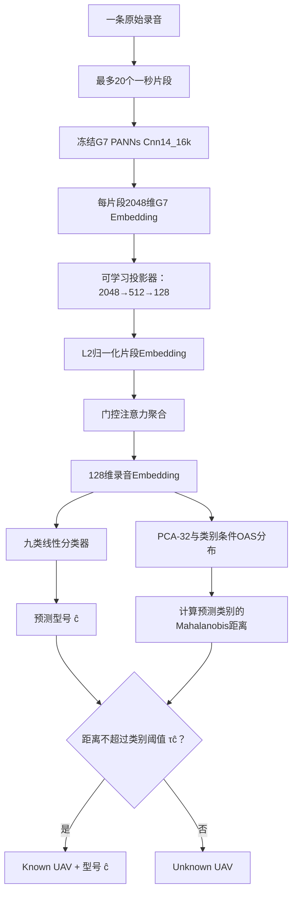

# G19监督对比表征、类别条件开放集与学习型录音聚合方案

更新日期：2026年7月28日

## 1. 文档状态

G19是建立在冻结G7声学表征之上的新开发分支，用于验证以下三个方法改动：

1. 监督对比Embedding；
2. 学习型录音聚合；
3. 类别条件开放集边界。

本文件描述的是已经进入工程实现的G19方法与预注册配置，不是实验结果报告。截至本文
更新时，代码、配置、运行入口和CPU测试已经完成，P0真实数据预检已经通过；P1正式
训练与P2校准尚未执行。因此不能声称G19已经提高九分类Accuracy、Unknown Recall、
AUROC或其他指标。后续数值必须来自新生成的G19产物，不能把G18结果改名为G19结果。

这里的三个组成方法均有公开研究基础，并非本工程从零发明。G19可主张的候选创新点是：
针对无人机声学型号识别，把录音级监督对比表征、可学习片段聚合和类别条件开放集距离
统一到同一条可复现实验链路中，并用严格的数据生命周期约束验证它们；论文中不应把
PANNs、监督对比学习、注意力池化、PCA、OAS或Mahalanobis距离分别宣称为原创算法。

---

## 2. 为什么建立G19

G18已经证明冻结G7的2048维Embedding中包含明显的型号信息，但现有方法仍有两个主要
限制：

- 九分类头在每个1秒片段上训练，录音级只做固定平均，训练目标与最终评价单位不一致；
- 开放集模块使用全局线性边界，难以处理“未知型号靠近某一个已知型号”的局部结构。

G18 P6的X6D/Y6最终Holdout已经执行并查看结果，其中X6D大量落入PHANTOM4区域。
这提示需要更有区分度的录音级Embedding和类别条件边界，但不能据此继续调P6阈值。

G19因此采用新的版本号、新代码、新配置和新产物目录：

```text
G18：保留，作为历史基线与可复现证据
G19：新方法开发，只使用Known Train、Known Tune、Unknown Tune
未来正式确认：必须获取从未参与G18/G19开发的新型号和新录音
```

G19不会覆盖G7或G18检查点，也不会改变G7二分类无人机检测的正式输出。

---

## 3. 数据边界

### 3.1 G19允许读取的数据

G19配置绑定G18 P0已经审计的三个分区：

| 分区 | 片段数 | 原始录音数 | G19用途 |
|---|---:|---:|---|
| `known_train` | 8,080 | 404 | 训练录音级表征和九分类器；拟合Known类别分布 |
| `known_tune` | 1,820 | 91 | 早停、Known开发评价和Known接纳率约束 |
| `unknown_tune` | 1,800 | 90 | MATRICE300/S900开发期开放集阈值校准 |

三个清单继续以`audio_sha256`作为录音隔离单位，每条录音最多20个1秒片段。输入清单、
G18 P0审计、G14片段缓存审计、官方PANNs检查点和G7检查点都在配置中绑定路径与
SHA256。运行前必须重新验证这些身份，不能仅凭文件名判断实验输入。

### 3.2 明确禁止的数据

G19配置和运行入口不得读取：

```text
known_holdout
unknown_holdout
X6D
Y6
G18 P6预测结果
```

原因是G18 P6已经消费。X6D/Y6现在可以用于解释历史失败，却不能再次作为“从未见过的
最终测试集”证明G19泛化。如果未来决定将X6D/Y6加入训练或开发，必须把它们明确登记
为已消费数据，新的正式Holdout仍需由全新型号承担。

---

## 4. 总体数据流



该图只描述G19型号分支。在完整系统中，输入仍应先通过G7无人机/背景门控；只有G7认为
存在无人机时才进入G19。开放集边界只决定接纳或拒绝，不能反过来修改九分类器选出的
具体型号。

---

## 5. 创新一：监督对比Embedding

### 5.1 投影器

冻结G7为每个片段产生2048维向量`x`。G19增加可训练投影器：

```text
x
→ LayerNorm
→ Linear(2048, 512)
→ GELU
→ Dropout(0.15)
→ Linear(512, 128)
→ L2 Normalize
→ z
```

G7全部参数保持冻结，只更新G19投影器、注意力聚合器和九分类器。这样既保护G7检测
能力，也让型号任务可以把通用声学表征重新组织为更紧凑的录音级度量空间。

### 5.2 监督对比损失

一个训练批次从九个Known型号中分别抽取两条录音，所以每个锚点至少存在一条“同型号、
不同录音”的正样本。不能把同一录音切出的两个相邻片段当作唯一正样本，否则模型可能
只记住录音环境。

对录音Embedding `h_i`，正样本集合为批次中与它型号相同的其他录音：

```text
P(i) = {p | y_p = y_i 且 p ≠ i}
```

监督对比损失鼓励相同型号录音靠近、不同型号录音分离：

```text
L_supcon =
  Σ_i -1/|P(i)| Σ_p∈P(i)
  log exp(sim(h_i,h_p)/T)
      / Σ_a≠i exp(sim(h_i,h_a)/T)
```

配置中的温度`T=0.07`。总训练损失为：

```text
L_total = L_recording_CE + 0.20 × L_supcon
```

录音级交叉熵使用`label_smoothing=0.05`。监督对比项不是Unknown训练：训练神经网络时
只使用九个Known型号，`unknown_tune`不会更新投影器、注意力或分类器权重。

### 5.3 预期作用与限制

期望效果是减小同一型号不同录音的类内距离，并增加容易混淆型号之间的间隔，为后面的
类别条件边界提供更规则的空间。但“类簇更紧”只是训练目标，不等于自动获得未知拒识
能力；必须用Tune指标和未来全新Holdout验证。

---

## 6. 创新二：学习型录音聚合

G18使用固定的片段Logit平均。G19改为门控注意力聚合，让模型在一条录音内部学习哪些
片段更能代表型号：

```text
e_s = wᵀ[tanh(W_v z_s) ⊙ sigmoid(W_g z_s)]
α_s = masked_softmax(e_s)
h   = normalize(Σ_s α_s z_s)
```

其中：

- `z_s`是第`s`个片段的128维Embedding；
- `α_s`是该片段的非负权重，所有有效片段权重和为1；
- padding片段通过布尔Mask获得严格为0的权重；
- `h`是九分类器和开放集模块共同使用的录音Embedding。

分类和开放集必须共享同一个聚合结果。不能在九分类时使用注意力池化、开放集时又使用
均值池化，否则开放集边界拟合的不是分类器实际使用的表征。

注意力也可能过拟合：当前Known Train只有404条录音，模型可能把设备噪声、固定距离或
某个采集会话误当作高价值证据。因此每次实验应同时报告注意力熵，并至少进行以下消融：

| 对照 | 目的 |
|---|---|
| 固定均值池化 | 判断提升是否真正来自学习型聚合 |
| 学习型门控注意力 | G19主方法 |
| 去掉监督对比损失 | 分离表征学习与聚合器贡献 |

---

## 7. 创新三：类别条件开放集边界

### 7.1 为什么不再只用一个全局线性边界

不同Known型号的类内离散程度并不相同。一个全局阈值可能对分布紧凑的类别过宽，又对
分布较散的类别过严。更重要的是，未知型号可能只靠近某一个已知类；G18 P6中出现的
PHANTOM4局部混淆正属于这种情况。

G19先用九分类Logit得到候选类别：

```text
ĉ = argmax classifier(h)
```

然后只在候选类别`ĉ`的局部分布中判断是否接纳。

### 7.2 PCA与OAS类别分布

对`known_train`录音Embedding统一拟合PCA并降至32维。随后对每个Known类别分别估计：

```text
类别中心 μ_c
OAS收缩协方差 Σ_c
精度矩阵 Σ_c⁻¹
```

OAS收缩估计用于降低有限录音数下协方差矩阵不稳定或不可逆的风险。对候选类别`ĉ`，
计算按维数归一化的平方Mahalanobis距离：

```text
d_ĉ(q) =
  (q - μ_ĉ)ᵀ Σ_ĉ⁻¹ (q - μ_ĉ) / 32
```

最终规则为：

```text
if d_ĉ(q) <= τ_ĉ:
    接纳为Known，输出类别ĉ
else:
    拒绝为Unknown UAV
```

距离越小表示越接近该Known类。边界不能把样本从类别A改判为类别B；它只接纳或拒绝
分类器已经给出的`ĉ`。

### 7.3 阈值与全局回退

类别阈值在`known_tune`和`unknown_tune`的录音级结果上校准，并要求总体Known接纳率
不低于0.90。`unknown_tune`按录音、按型号和固定seed进行确定性拆分，其中配置的
`unknown_calibration_fraction=0.40`决定阈值校准子集。

MATRICE300和S900不一定被九分类器预测到全部九个候选类，因此某些类别可能没有足够
Unknown样本来单独估计阈值。G19规定：

- 每类至少5条Known Tune录音；
- 每类至少3条被预测到该类的Unknown校准录音；
- 任一支持量不足时，以全局阈值为基础，并取“不低于该预测类别Known接纳率约束所需
  阈值”的Known接纳保护值（该值对Known更宽松，不代表对Unknown拒识更严格）；
- 报告必须列出哪些类别使用回退，不能把回退值伪装成独立类别阈值。

这项机制解决的是有限校准数据下的数值稳健性，不代表仅靠MATRICE300/S900就覆盖了
所有未知型号形态。

---

## 8. 训练、校准与评价顺序

```text
P0：预检
  ├─ 验证清单、审计、PANNs和G7 SHA256
  ├─ 验证录音隔离与禁止字段
  └─ 验证九类均衡批次能够为每个锚点提供正样本
        ↓
P1：录音级表征训练
  ├─ 冻结G7并缓存known_train/known_tune片段Embedding
  ├─ 只用known_train更新G19
  ├─ 用known_tune早停和选检查点
  └─ 保存配置SHA256、代码/输入身份、历史与最佳检查点
        ↓
P2：类别条件开放集校准
  ├─ 缓存unknown_tune片段Embedding（不反向更新G19）
  ├─ known_train拟合PCA和九个OAS类别分布
  ├─ known_tune约束Known接纳率
  ├─ unknown_tune开发子集选择类别阈值
  └─ 保存候选边界、阈值、回退类别和开发指标
        ↓
未来：新数据一次性正式评价
```

G19当前只能报告开发结果。`known_tune`和`unknown_tune`一旦用于早停、方法选择或阈值
选择，就不是最终测试集。

P2把Unknown Tune按录音拆成阈值拟合子集和同型号录音审计子集，但Known一侧仍复用
已经用于P1选模和P2阈值约束的`known_tune`。因此P2输出名称是“同Known、同Unknown
型号的开发候选门”，不是独立验证；即使通过，也只能授权冻结方案并寻找全新最终数据。

### 8.1 当前自动输出的Known指标

- 录音级Accuracy、Macro-F1和每类Recall；
- 最差类别Recall；
- Top-1/Top-3准确率；
- 混淆矩阵；
- 归一化注意力熵。

片段级/录音级差异和均值聚合消融属于后续对照实验，不由G19主配置自动生成。

### 8.2 当前自动输出的开放集指标

- Known/Unknown ROC-AUC和PR-AUC；
- `FPR≤0.05`的标准化pAUC；
- Unknown Recall；
- Known接纳率与Known误拒率；
- 每个Unknown型号Recall；
- 每个预测Known类别的Unknown误接纳数；
- 使用全局回退阈值的类别列表。

总体平均指标不能掩盖某个Unknown型号Recall为0，也不能用类别条件边界后的Known接纳率
代替九分类正确率。

### 8.3 预注册开发候选门

| 阶段 | 条件 |
|---|---:|
| P1 | 录音级Macro-F1 ≥ 0.50 |
| P1 | 最差Known类别Recall ≥ 0.20 |
| P2 | Known接纳率 ≥ 0.90 |
| P2 | Known正确且被接纳率 ≥ 0.70 |
| P2 | 最低有支持预测类Known接纳率 ≥ 0.70 |
| P2 | 同Unknown型号录音审计Unknown Recall ≥ 0.80 |
| P2 | 最差Unknown型号Recall ≥ 0.70 |
| P2 | 开放集Balanced Accuracy ≥ 0.85 |
| P2 | Known/Unknown ROC-AUC ≥ 0.70 |

这些门只决定是否保留G19作为开发候选，不能把候选边界变成“最终可部署边界”。P2
报告会将`passed`设为所有门的合取，并始终写明`deployable_final_boundary=false`。

---

## 9. 运行入口

统一脚本支持五种模式：

```bash
cd /home/user1/JJZ/ABDDV-CRNN

# 只做身份、隔离和训练批次契约预检，不执行优化器更新
bash scripts/run_g19_supcon_attention.sh preflight

# 训练监督对比Embedding与学习型录音聚合
bash scripts/run_g19_supcon_attention.sh train

# 从latest.pt恢复中断训练，并恢复Python/NumPy/Torch随机数状态
bash scripts/run_g19_supcon_attention.sh resume

# 拟合PCA/OAS类别分布并校准开放集阈值
bash scripts/run_g19_supcon_attention.sh calibrate

# 查看当前阶段
bash scripts/run_g19_supcon_attention.sh status
```

需要保留完整终端记录时可由调用者显式写日志：

```bash
bash scripts/run_g19_supcon_attention.sh train \
  2>&1 | tee logs/g19_supcon_attention.log
```

脚本默认使用`/usr/local/anaconda3/envs/dads-crnn/bin/python`，可通过`PYTHON_BIN`覆盖。
配置文件为`configs/g19_supcon_attention.yaml`，所有新产物写入
`artifacts/g19_supcon_attention/`，不覆盖G18目录。

冻结G7特征缓存单独位于`artifacts/g19_supcon_attention/feature_cache/`。缓存身份绑定
清单、片段缓存审计、官方/G7检查点、PANNs与录音加载代码、vendor Python源码、
16000目标采样点、维数和`float32`类型；任一身份变化都会拒绝混用旧缓存。P2边界保存为
`candidate_class_conditional_boundary_v1.npz`，内部同时绑定表示检查点SHA256和校准
身份SHA256；它是研究候选产物，不是最终部署产物。

---

## 10. 风险与必须完成的消融

| 风险 | 可能造成的假象 | 控制方法 |
|---|---|---|
| 同设备、有限会话 | 学到录音设备或采集条件 | 新增跨设备、跨地点、跨会话数据 |
| 每型号物理个体不足 | 学到单个机体声纹 | 每型号采集多个物理个体并按个体隔离 |
| 注意力过拟合 | 少数片段权重极端集中 | 报告注意力熵，与均值池化对照 |
| 监督对比批次错误 | 同类锚点没有正样本 | 九类均衡采样，每类至少两条录音 |
| 类别协方差样本少 | 距离不稳定 | PCA-32、OAS收缩和支持量检查 |
| Unknown类型过少 | Tune高、换型号后失败 | 增加多旋翼结构和近邻Unknown，冻结新Holdout |
| 使用已消费P6调参 | 最终结果被开发污染 | 代码与配置禁止任何holdout输入 |
| 重复缓存或清单漂移 | 看似同实验实际输入不同 | 清单、审计、PANNs、G7和缓存身份校验 |

最少需要报告五组受控对照：

1. G18线性头 + 固定平均；
2. 投影器 + 交叉熵 + 固定平均；
3. 投影器 + 监督对比 + 固定平均；
4. 投影器 + 监督对比 + 门控注意力；
5. 在同一最佳录音表征上比较全局边界与类别条件边界。

前四组用于分离Embedding与聚合贡献，第五组用于分离开放集边界贡献。所有比较都只能
在开发分区进行，不能重新比较P6后挑选最优方法。

---

## 11. 当前可成立与不可成立的结论

当前可以成立：

- G19已经确定独立的数据协议、模型结构、损失、开放集规则和产物目录；
- G7继续冻结，G18历史产物保持不变；
- G19只允许使用Known Train、Known Tune和Unknown Tune开发；
- 三个方法改动有清晰、可单测的主方法接口；受控消融尚待后续实验实现。

当前不能成立：

- G19的九分类准确率高于G18；
- 监督对比Embedding已经改善类间分离；
- 注意力聚合已经优于平均聚合；
- 类别条件边界已经改善Unknown Recall或AUROC；
- G19已经通过全新型号、跨设备或真实环境验证。

只有完成P0、P1和P2后，才能报告G19开发集指标；只有在方法、阈值和随机种子全部冻结
后，用全新且从未参与开发的无人机型号执行一次性测试，才能形成新的最终泛化结论。
