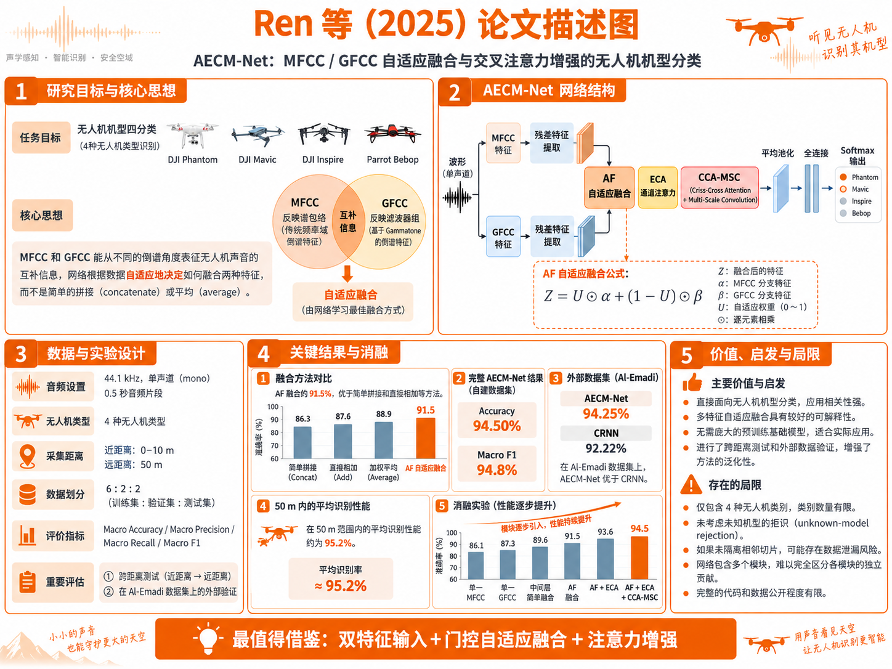

# 近三年声学无人机识别四篇核心论文详解

**整理时间：** 2026-09-08  
**时间范围：** 2024—2026 年  
**研究重点：** 纯声学无人机检测与机型分类  
**说明：** 本文中的“分类”包含两个层次：无人机/非无人机二分类，以及无人机型号多分类。定位、轨迹估计、故障诊断和多模态识别不作为主要讨论对象。

---

## 1. 为什么选择这四篇

近三年的声学无人机论文中，有些工作报告了 98% 甚至 99% 以上的准确率，但如果数据来自同一次录音的密集切片，并随机分到训练集和测试集，这种结果很可能高估模型对新环境、新设备和新无人机的能力。因此，本文不按照“准确率排行榜”选论文，而按以下标准筛选：

1. 是否直接解决声学无人机检测或机型分类；
2. 是否代表一个重要技术方向；
3. 实验设计是否包含多机型、跨距离、跨设备或跨数据集；
4. 是否提供消融实验，能够判断性能提升来自哪里；
5. 是否能为后续研究和当前工程提供可执行的方法。

最终选出以下四篇：

| 排名 | 论文 | 主要任务 | 代表方向 | 选择理由 |
|---|---|---|---|---|
| 1 | Reuter 等，2026 | 无人机/非无人机检测 | 预训练、数据增强、跨数据集泛化 | 评价协议最接近真实部署，明确在固定低误报率下比较域内与域外性能 |
| 2 | Vilhurin 等，2026 | 复杂环境小型无人机检测 | PCEN、弱标签、设备域偏移、极端类别不平衡 | 使用真实战场录音，研究问题比普通安静环境分类更困难、更有实际价值 |
| 3 | Ren 等，2025，AECM-Net | 四种无人机机型分类 | MFCC/GFCC自适应融合、注意力、多尺度特征 | 与“无人机型号分类”最直接，并进行了跨距离和外部数据集验证 |
| 4 | Berg 等，2025 | 31种无人机机型分类 | 预训练CNN、AST、PEFT、小数据训练 | 类别数较多，系统比较CNN、Transformer、全量微调和参数高效微调 |

四篇论文分别回答四个关键问题：

```text
Reuter：模型换一个数据集后还能不能检测？
Vilhurin：在真实强噪声、弱标签和不同麦克风下还能不能检测？
Ren：如何区分声学特征相近的不同无人机型号？
Berg：只有少量多类别数据时，预训练CNN和Transformer应该怎么选？
```

### 1.1 阅读与证据说明

本文已重新依据四篇原论文的正文、公式和实验表格整理。为避免把作者结论和本文判断混在一起，采用以下表述规则：

- **“原论文报告”**：能够在原论文的方法、数据表、实验表或结论中直接找到；
- **“本文解读”**：根据原论文结果进行的方法学解释；
- **“风险判断”**：论文没有给出足够信息，因而不能确认泛化能力或复现条件；
- 表格编号均指对应论文自己的编号，不是本文的编号。

尤其需要注意：论文报告的Accuracy、F1和TPR所对应的任务、数据分布和阈值完全不同，不能直接按百分比高低排序。

---

## 2. Reuter 等（2026）：预训练与增强驱动的跨域无人机检测


*图1　Reuter等（2026）研究目标、SE-ResNet18结构、四类增强、数据集和关键结果概览。*

### 2.1 基本信息

- **题目：** *Improving Acoustic Drone Detection Generalization through Pretraining and Data Augmentation*
- **作者：** Paul M. Reuter、Mattes Ohlenbusch、Christian Rollwage
- **发表状态：** Quiet Drones 2026 接收，arXiv 版本公开于 2026-05-29
- **论文链接：** [arXiv:2605.31329](https://arxiv.org/abs/2605.31329)
- **任务：** 无人机/非无人机二分类
- **核心关键词：** AudioSet预训练、SE-ResNet18、麦克风频响增强、跨数据集测试、低误报率评估

### 2.2 研究问题

论文没有把重点放在设计更复杂的网络，而是直面声学无人机检测中最重要的问题：

> 在训练环境中准确的模型，换到另一种麦克风、另一批无人机、另一处场地后，是否仍能工作？

普通随机切片实验主要测量模型对同一数据分布的拟合能力。Reuter 等则明确区分：

- **域内测试：** 设备、环境或无人机与训练条件相近；
- **域外测试：** 麦克风、环境、无人机型号和数据处理方式不同；
- **域外负类测试：** 使用模型没有见过的交通声和ESC-50环境声音检查误报；
- **距离分层测试：** 按0—50 m、50—100 m、100—150 m、150—200 m分别计算性能。

这使论文的核心贡献从“提高Accuracy”变成“提高可迁移性并验证工作点”。

### 2.3 输入与网络结构

音频首先统一到16 kHz，使用1秒片段。前端大致为：

```text
16 kHz单通道波形
  → 25 ms Hann窗
  → 10 ms帧移
  → 80维Log-Mel频谱
  → 18层二维SE-ResNet
  → 全局聚合与二分类输出
```

SE-ResNet在普通残差网络中加入Squeeze-and-Excitation通道重标定。卷积负责提取局部谐波、频带纹理和时间变化，SE模块则学习哪些通道更重要。相比大型AST或通用音频基础模型，这个网络更适合短时窗口和实时检测。

论文使用与无人机任务相同的网络和声学前端先在AudioSet声音事件分类任务上预训练，再将卷积层和全连接层权重迁移到无人机二分类任务。这一点很关键：预训练不仅提供“无人机声音”知识，还提供车辆、机械、昆虫、风噪和其他环境声的区分能力。

### 2.4 四类数据增强

论文的增强链同时覆盖声源变化、背景变化、传感器变化和频谱缺失：

1. **仅正类音高变换。** 以0.25概率将无人机音频随机移动±1到±5个半音，用于模拟不同旋翼转速、桨叶和机型产生的基频变化。
2. **背景噪声混合。** 以0.33概率加入非无人机背景，目标SNR从10—20 dB均匀采样。
3. **麦克风传递函数模拟。** 以0.33概率施加随机IIR滤波器级联，包括60—120 Hz高通、6—8 kHz低通以及2—3个随机峰值均衡器，模拟不同设备的频响差异。
4. **频率遮挡。** 以0.5概率施加最多三个频率掩码，每个最多遮挡15%的Mel频带。论文刻意不使用时间遮挡，以免破坏无人机的时间包络。

它们分别对应真实域偏移中的四类因素：

```text
无人机/转速变化 → Pitch Shift
环境变化       → Background Mixing
录音设备变化   → Microphone IIR
编解码/频带损失 → Frequency Masking
```

### 2.5 数据与评价协议

论文组合使用内部阵列数据和多个公开数据集：

- 内部八麦克风阵列数据用于训练及域内测试；
- IDMT Berne 2022用于域内测试和距离分析；
- AuDroK的多个子集用于域外无人机检测；
- IDMT-TRAFFIC与ESC-50用于域外负类误报测试。

测试阈值仅根据域内背景校准，使FPR达到1%或5%，再固定阈值测试其他数据集。主要指标不是Accuracy，而是：

\[
\mathrm{TPR@FPR=1\%}
\]

即将误报率限制为1%时能够检出的无人机比例。所有训练配置使用10个随机种子，报告均值和标准差，可信度明显高于单次训练结果。

### 2.6 关键实验结果

在FPR校准为1%的条件下：

| 训练配置 | IDMT-Test TPR | Berne TPR | AuDroK域外平均TPR |
|---|---:|---:|---:|
| 随机初始化 | 0.860 | 0.816 | 0.701 |
| AudioSet预训练 | 0.920 | 0.892 | 0.783 |
| 预训练＋麦克风增强 | 0.923 | 0.891 | 0.816 |
| 完整增强链 | 0.921 | 0.883 | **0.825** |

最重要的结论是：

- **预训练贡献最大。** AuDroK上的TPR由0.701提升到0.783；
- **麦克风频响增强是最有效的单项域增强。** 加入后由0.783升到0.816；
- **完整增强主要改善域外性能，并不保证域内性能同步提高；**
- 在最困难的Audacity子集上，完整方案将TPR从0.166提升到0.662，说明增强的收益集中在失配严重的数据上。

距离实验表明，在FPR=1%的严格工作点下：

- 0—50 m：预训练模型TPR约0.99；
- 50—100 m：约0.81—0.83；
- 100—150 m：约0.52—0.58；
- 150 m之后快速下降；
- 200 m以上接近零。

把测试窗口由1秒延长到2秒，对近距离帮助不大，但100—150 m的TPR由0.522提高到0.675，说明长窗口能积累弱无人机声的证据。

### 2.7 论文的真正价值

这篇论文最值得复现的不是SE-ResNet18本身，而是实验范式：

1. 用声音事件预训练代替从零训练；
2. 对麦克风频响进行结构化模拟；
3. 严格区分训练、阈值校准和域外测试；
4. 在固定低FPR下报告TPR；
5. 分析距离、设备和负类类别对应的失效模式。

论文还指出洗衣机、链锯、昆虫和吸尘器等持续谐波声音最容易触发误报。这比一个总Accuracy更能指导困难负类的采集。

### 2.8 局限性

- 主要任务是二分类检测，没有进一步区分无人机型号；
- 内部训练数据和完整模型权重未公开，无法完全复现原始结果；
- FPR=1%如果按独立1秒窗口解释，理论上仍可能产生约36个误报窗口/小时，实际系统还需要时间平滑和告警合并；
- 音高变化可能生成不完全符合物理规律的旋翼声；
- 超过150—200 m后，模型改进无法弥补传感器信噪比不足。

### 2.9 对后续研究的借鉴

对于现有CRNN工程，优先级应是：

1. 保留现有模型作为随机初始化基线；
2. 增加AudioSet/PANNs/BEATs预训练基线；
3. 单独消融麦克风IIR、背景混合、频率遮挡和音高变换；
4. 按录音文件或飞行架次分组，而不是按切片随机划分；
5. 用独立调参集确定阈值，再一次性评估外部测试集；
6. 同时报告AUROC、AUPRC、TPR@1%FPR和每小时告警次数。

### 2.10 按原论文方法与表格进一步精读

#### 2.10.1 特征张量到底是什么

原论文第2.1节说明，每个输入片段在提取特征前先缩放到单位RMS，然后计算25 ms窗长、10 ms帧移的STFT，经过覆盖0—8 kHz的80个Mel滤波器，对功率结果取以10为底的对数。1秒输入最终形成：

\[
\mathbf X\in\mathbb R^{80\times100}
\]

即80个Mel频带、100个时间帧。单位RMS归一化有两个作用：其一，避免模型仅凭总体响度判断无人机；其二，让不同录音增益更可比。它也有代价：距离导致的绝对声压衰减信息被主动去掉，因此模型必须更多依赖谐波纹理、频谱包络和时间调制。这是论文能够跨设备泛化的重要设计，同时也意味着模型不能单独用输入振幅估计距离。

#### 2.10.2 SE-ResNet18的逐层逻辑

原论文第2.2节给出的主干包含4个阶段，通道数依次为：

\[
[16,32,64,128]
\]

每个阶段包含两个SE残差块。末端不是直接对整张频谱做二维全局平均，而是：

1. 先沿频率轴取平均，把二维时频特征变成时间序列；
2. 再沿时间轴进行Self-Attentive Pooling；
3. 映射为256维向量；
4. 通过单个线性输出和Sigmoid得到无人机概率。

因此该模型本质上是“二维卷积局部特征＋注意力时间聚合”。注意力池化使网络可以重点利用1秒内无人机声最明显的帧，而不是假设所有帧贡献相同。

AudioSet预训练使用相同前端和主干，但输入为2秒频谱。迁移到无人机任务时，作者保留所有卷积层和稠密层权重，仅替换最终分类层。这比只拿ImageNet视觉权重初始化更贴近声学域。

#### 2.10.3 原论文的数据隔离方式

原论文第3节报告，内部数据约包含71小时无人机信号和380小时背景信号，由边长0.15 m的八麦克风立方阵列采集。训练和域内测试按完整录音会话隔离：IDMT-Test的8个会话不参加训练。

训练数据还加入：

| 数据来源 | 内容 | 用途 |
|---|---|---|
| IDMT-Train内部数据 | 无人机＋背景 | 主训练集 |
| AuDroK 23-02-22 | 消声室无人机，排除起降段 | 训练正类 |
| AuDroK 23-06-07 | 室外无人机＋背景 | 训练 |
| DroneNoiseDatabase | 野外无人机噪声 | 训练正类 |
| SoundSnap | 困难非无人机声音 | 独立负类训练，不用于噪声混合 |

严格排除于训练的数据包括：

| 数据来源 | 域属性 | 用途 |
|---|---|---|
| IDMT-Test | 域内 | 阈值校准和域内测试 |
| IDMT Berne 2022 | 同阵列、不同会话 | 域内补充测试和距离分析 |
| AuDroK OOD五个子集 | 域外 | 跨无人机、麦克风、环境测试 |
| IDMT-TRAFFIC | 域外负类 | 交通背景误报测试 |
| ESC-50 | 域外负类 | 广泛环境声误报测试 |

这里值得借鉴的是：阈值在IDMT-Test背景上确定以后被冻结，再用于所有其他数据集。AuDroK OOD的总结果按五个子集等权平均，而不是按片段总数加权，从而避免大子集掩盖困难小子集。

#### 2.10.4 训练超参数与消融顺序

原论文第2.4节给出：

| 项目 | 从零训练 | 预训练微调 |
|---|---:|---:|
| 损失 | Binary Cross-Entropy | Binary Cross-Entropy |
| 优化器 | Adam | Adam |
| 初始学习率 | \(10^{-3}\) | \(10^{-3}\) |
| Batch size | 128 | 128 |
| Epoch | 120 | 15 |
| 学习率衰减 | 每3轮乘0.9 | 每轮乘0.75 |
| 随机种子 | 10次独立训练 | 10次独立训练 |

消融按`No-PT → PT → PT+mic → +background → +frequency mask → +pitch`逐项累加。这种累加式消融能回答“在已有组件基础上再加入一项是否有效”，但不能完全测量每个增强的独立主效应，因为加入顺序固定。例如，论文没有直接报告“只加Pitch、不加其他增强”的结果。

#### 2.10.5 如何正确解读表3和表4

原论文表3显示，AudioSet预训练将AuDroK OOD的TPR@1%FPR从0.701提高到0.783，是最大单步增益；仅加入麦克风IIR后进一步提高到0.816。完整增强达到0.825，但IDMT-Test由最佳的0.926略降到0.921，Berne由0.892附近降到0.883。

本文解读是：增强并非让模型在所有分布上统一变好，而是用少量域内性能换取域外稳健性。对于以外部部署为目标的系统，这种交换可能值得；对于固定设备、固定场地系统，则不一定需要完整增强链。

原论文表4还显示，在域内校准到1%FPR后，完整模型在IDMT-TRAFFIC上的实际FPR为0.010，在ESC-50上为0.025。说明交通噪声迁移较稳定，但更广泛的环境声仍使误报率升至目标值的2.5倍。最易误报类别及其FPR分别为：

- Washing machine：0.168；
- Chainsaw：0.162；
- Insects：0.143；
- Vacuum cleaner：0.089。

这些类别都含有持续或准周期机械纹理，和旋翼声具有结构相似性。后续困难负样本采集应该优先覆盖这些声音，而不是无限增加普通静音或白噪声。

#### 2.10.6 原论文没有解决的问题

原论文能够证明“检测器对部分未见域更稳健”，但不能证明：

- 可以识别具体无人机型号；
- 能拒绝所有未见类型的旋翼声源；
- 1%片段FPR已经满足告警系统要求；
- 同一套增强参数对所有麦克风有效；
- AudioSet预训练优于所有更现代的PANNs、BEATs或自监督编码器。

所以该论文最适合作为检测前端和泛化评价协议，而不是完整的机型识别方案。

---

## 3. Vilhurin 等（2026）：战场强噪声、域偏移和弱标签检测


*图2　Vilhurin等（2026）问题场景、PCEN与ConvNeXt-Tiny结构、双设备域、训练策略和实验结果概览。*

### 3.1 基本信息

- **题目：** *Acoustic UAV Detection in Battlefield Scenarios: Handling Noise, Domain Shift, and Weak Labels*
- **作者：** Vadym Vilhurin、Volodymyr Sydorskyi、Andrii Shevtsov
- **发表状态：** ICMCIS 2026会议论文，arXiv版本公开于2026-08-14
- **论文链接：** [arXiv:2608.14287](https://arxiv.org/abs/2608.14287)
- **任务：** 小型无人机/其他声音检测，训练时包含飞机、直升机等辅助类别
- **核心关键词：** PCEN、ConvNeXt-Tiny、注意力池化、弱标签、设备域偏移、噪声注入Mixup

### 3.2 研究问题

这篇论文研究的不是“干净数据上能否识别”，而是更困难的部署条件：

- 无人机目标在训练数据中占比不足1%；
- 只有文件级标签，不知道无人机具体在哪一秒出现；
- 两种麦克风的安装高度、频响和环境完全不同；
- 目标域包含风、人声、音乐、机器声和战场杂波；
- 相邻切片来自连续录音，必须防止相似片段跨集合泄漏。

因此它既是无人机检测论文，也是弱标签声音事件检测和声学域泛化论文。

### 3.3 数据设计

所有音频采样率为32 kHz，切分为9秒片段。两类设备构成两个域：

- **Mic-1：** 安装在10—40 m高的通信塔上，环境相对稳定，但包含机械振动、风声和动物声；
- **Mic-2：** 距地约1 m，部署于前线，是最终目标域，包含人声、音乐、机械和复杂战场背景。

小训练集中，Mic-1包含约11.9小时Drone、15小时Jet Aircraft、6.4小时Helicopter、4.5小时Propeller Aircraft和125小时Noise；Mic-2只有441个小型无人机片段、约1.1小时，以及约6.3小时Noise。论文按连续音频流分组，使同一音频流的所有切片只出现在一个集合中，这一点有效降低了数据泄漏风险。

### 3.4 声学表示：为什么使用PCEN

传统Log-Mel通常取对数压缩：

\[
X_{\log}(t,f)=\log(M(t,f)+\epsilon)
\]

PCEN则带有随时间变化的平滑能量估计，可理解为“每个频带上的自动增益控制＋动态范围压缩”：

\[
\mathrm{PCEN}(t,f)=
\left(\frac{M(t,f)}{(\epsilon+E(t,f))^{\alpha}}+\delta\right)^r-\delta^r
\]

其中，\(E(t,f)\)是该频带的平滑背景能量。对于持续风噪或稳定机械声，PCEN会降低背景能量的影响，使较弱的旋翼谐波更突出。

论文同时训练Log-Mel和PCEN模型，因为两者的失效模式不同：Log-Mel对增益变化敏感，PCEN对参数设置敏感；二者集成可以获得互补收益。

### 3.5 网络结构

整体流程为：

```text
32 kHz、9秒波形
  → Log-Mel或PCEN
  → ConvNeXt-Tiny主干
  → 频率投影器
  → SED式注意力池化
  → 文件级类别概率
```

关键模块包括：

1. **ConvNeXt-Tiny。** 使用ImageNet-1K预训练权重，将频谱视为二维输入，参数量约28.22M；加入频率投影器后约30.97M。
2. **频率投影器。** 通过频率方向的一维卷积保留频谱拓扑，避免全局平均池化过早丢失不同频带之间的谐波比例。
3. **注意力池化。** 因为只有文件级弱标签，模型必须自行找到9秒中最可能包含无人机的帧，再聚合为片段级判断。
4. **辅助类别训练。** 将喷气式飞机、直升机和螺旋桨飞机作为辅助类别，迫使网络学习更细致的谐波差异，而不是简单学习“有持续机械能量即为无人机”。

### 3.6 训练策略

针对目标类别不足1%的问题，论文使用平方根采样降低类别不平衡。主要增强包括：

- ±100 ms时间平移；
- 正弦时间扭曲；
- ±3 dB随机增益；
- 波形反转；
- 仅与噪声混合的Noise-injection Mixup；
- Curriculum RMS Masking。

Noise-injection Mixup不是在任意两个类别之间混合，而是把训练样本与Mic-1或Mic-2噪声混合，且保留原始标签，用来合成低SNR和跨设备背景。

Curriculum RMS Masking先寻找能量最大的2秒区域，再遮挡其中0.3—1秒，并随训练进程逐渐增加遮挡长度。它强迫模型不要只依赖最响的一小段，而要寻找分布在全片段中的较弱谐波证据。

训练使用AdamW、初始学习率\(10^{-4}\)、Cosine Annealing、100个epoch、batch size 64和Focal Loss。

### 3.7 关键实验结果

单模型的逐步消融结果如下：

| 方法 | 测试F1 | Precision | Recall |
|---|---:|---:|---:|
| 仅Mic-2基线 | 17.4% | 87.7% | 约9.7% |
| Mic-2＋Mic-1辅助域 | 49.8% | 88.8% | 34.6% |
| 加SWA | 59.7% | 87.2% | 45.3% |
| 加噪声注入Mixup | 75.6% | 74.4% | 76.9% |
| 加频率投影器 | 77.8% | 92.7% | 67.1% |
| PCEN＋投影器＋完整数据 | **78.6%** | 84.3% | 73.6% |

进一步集成Log-Mel与PCEN模型后：

- 小训练集集成F1为81.14%；
- 完整训练集集成F1为82.22%；
- 开源AST-Drone基线F1为55.36%；
- 对近中距离数据的ROC AUC为97.2%，远距离为93.8%。

摘要中“55.4%提高到78.6%”对应公开基线与最佳单模型的比较；82.22%是两个声学表示集成后的结果，不能混为同一个模型指标。

### 3.8 论文的真正价值

这篇论文说明，真实场景性能的关键往往不是换一个更大的模型，而是：

- 选择适应动态背景的声学表示；
- 正确处理弱标签；
- 利用相似声源作为辅助类别；
- 模拟目标域噪声；
- 避免模型只依赖最高能量区域；
- 按连续录音流隔离数据。

尤其值得注意的是，仅在少量Mic-2数据上训练时模型几乎塌缩，而加入Mic-1辅助域后才获得可用表示。这说明“更多但不完全同域的数据”在合理训练策略下，比“少量完全同域数据”更有价值。

### 3.9 局限性

- 任务仍是小型无人机检测，没有进行具体型号分类；
- 战场数据因安全和隐私原因很难完全公开，精确复现受限；
- ConvNeXt-Tiny约28—31M参数，双模型集成约61.94M，不属于真正的轻量系统；
- PCEN参数对设备和环境敏感，需要重新校准；
- 距离标签来自人工感知分级，而不是精确测距；
- 集成提高性能，但增加推理延迟和维护成本。

### 3.10 对后续研究的借鉴

最适合迁移到现有项目的部分是：

1. 增加PCEN与Log-Mel双前端对照；
2. 把直升机、螺旋桨飞机、链锯、昆虫和机械设备作为困难辅助类别；
3. 对类别极不平衡问题使用Focal Loss与分源采样；
4. 将普通平均池化替换为注意力池化或录音级多实例学习；
5. 进行跨麦克风、跨季节和跨地点测试；
6. 保证同一连续录音流不跨训练、验证和测试集合。

### 3.11 按原论文数据表与方法进一步精读

#### 3.11.1 超过30万片段不等于30万个独立事件

原论文第4节说明，数据集包含超过30万个9秒片段，但这些片段由连续音频流切分而来，相邻片段可能相关或高度相似。作者因此把同一连续音频流的全部片段锁定在同一个集合中。这一细节非常重要：如果只看到“30万样本”而忽略其来源，会严重高估有效独立样本量。

作者构建了Small和Full两套训练集。原论文表1给出的分布为：

| 训练版本 | 设备 | 类别 | 片段数 | 时长/h |
|---|---|---|---:|---:|
| Small | Mic-1 | Drone | 4758 | 11.9 |
| Small | Mic-1 | Jet Aircraft | 6012 | 15.0 |
| Small | Mic-1 | Helicopter | 2559 | 6.4 |
| Small | Mic-1 | Propeller Aircraft | 1797 | 4.5 |
| Small | Mic-1 | Noise | 50000 | 125.0 |
| Small | Mic-2 | Small Drone | 441 | 1.1 |
| Small | Mic-2 | Noise | 2519 | 6.3 |
| Full | Mic-1 | Drone | 5421 | 13.7 |
| Full | Mic-1 | Jet Aircraft | 7141 | 18.1 |
| Full | Mic-1 | Helicopter | 3225 | 8.0 |
| Full | Mic-1 | Propeller Aircraft | 2194 | 5.6 |
| Full | Mic-1 | Noise | 304919 | 761.2 |
| Full | Mic-2 | Small Drone | 4648 | 11.6 |
| Full | Mic-2 | Noise | 5316 | 13.1 |

Small集中的Mic-2样本不足总训练数据的1%，真正目标类Small Drone只有441个片段。Full集虽然把目标类扩展到4648个片段，但同时包含超过30万条Mic-1噪声，仍然是极端不平衡问题。

#### 3.11.2 类别定义并不是“具体机型”

原论文将Mic-1的Drone定义为以Shahed类和其他远程无人机为主的集合，可能同时包含电动和内燃机平台；Mic-2的Small Drone则聚合FPV、DJI Mavic、夜间轰炸无人机和光纤FPV等小中型平台。

作者明确说明，仅靠人工听感往往无法稳定区分这些具体机型，所以采用聚合标签。由此可知，这篇论文证明的是“复杂环境中的无人机类别检测”，不是机型级身份识别。把其82.22% F1引用为“无人机型号分类准确率”是不正确的。

#### 3.11.3 验证集和测试集具有真实时间偏移

原论文没有使用K折，而是固定划分：

- 训练集：非战区受控外场测试；
- 验证集：冬季数据，包含战区和外场测试；
- 测试集：春季、仅来自真实战区，并且地点未见。

因此验证集与测试集不仅设备不同，还包含季节、地点和采集条件变化。原论文表2中，目标域验证集包含805个Small Drone片段和343个Noise片段；目标域测试集包含2545个Small Drone片段和2549个Noise片段。测试集并不是从训练录音随机抽取的普通holdout。

#### 3.11.4 前端参数与网络实现

原论文第7节和训练设置给出两种前端：

| 前端 | 窗长 | Hop | 频带数 | 输入长度 |
|---|---:|---:|---:|---:|
| Log-Mel基线 | 2048 samples | 512 samples | 128 Mel | 9 s |
| PCEN/高分辨率配置 | 4096 samples | 512 samples | 256 bands | 9 s |

采样率为32 kHz，因此512点Hop约为16 ms，2048点窗约64 ms，4096点窗约128 ms。较长窗提高频率分辨率，有利于观察密集旋翼谐波，但会降低瞬态时间分辨率。这与该论文关注持续9秒无人机声而非毫秒级事件是一致的。

主干使用ImageNet-1K预训练ConvNeXt-Tiny。这里的预训练仍是视觉域预训练，与Reuter的AudioSet声学预训练不同。频率投影器替换GeM频率池化，通过沿频率方向卷积，把不同频带的结构映射成可学习表示；它的目标不是简单扩大网络，而是防止强低频噪声在全局池化时淹没弱谐波。

#### 3.11.5 弱标签注意力池化的含义

9秒文件只有一个类别标签，模型不知道目标在什么时刻出现。SED式注意力头为每个时间位置产生类别得分和注意权重，再聚合为文件级预测。其逻辑接近多实例学习：

\[
p(c\mid x)=\sum_t a_{t,c}\,p_{t,c},\qquad \sum_t a_{t,c}=1
\]

其中\(p_{t,c}\)是时间位置\(t\)对类别\(c\)的局部判断，\(a_{t,c}\)是模型学习的注意权重。这样只需要文件级标签，也能自动寻找疑似目标区段。

原论文还针对多分类修改注意力头：移除注意机制中的tanh限制，并将最终Sigmoid替换为类别Softmax，强制辅助类别互斥。最终报告二分类Small Drone vs. all，但模型选择采用包含辅助类别的Macro-F1，防止只针对少量目标样本调出不稳定检查点。

#### 3.11.6 域偏移是否真的被消除

作者使用设备来源预测作为对抗式验证。如果一个分类器可以轻松判断声音来自Mic-1还是Mic-2，说明表示仍携带很强的设备信息。原论文表4为：

| 表示 | 测试设备判别ROC AUC | 测试F1 |
|---|---:|---:|
| 基线Log-Mel | 97.07% | 66% |
| 增强方案 | 69.1% | 62% |

设备判别AUC从97.07%下降到69.1%，说明增强表示确实减少了设备指纹，但仍高于随机水平50%，所以域对齐并未完成。

原论文表3还显示，PCEN对“Mic-2冬季噪声 vs. 春季噪声”的聚类纯度由基线98.79%降到93.91%，轮廓系数由0.3851降到0.2592。作者把更低的可分性解释为更强的季节不变性。但对于Mic-1/Mic-2全局噪声域，增强Log-Mel并未一致改善全部聚类指标，因此不能简单声称所有设备偏移都被解决。

#### 3.11.7 为什么Mixup是最大性能转折点

从原论文表5看：

```text
Mic-2单独训练：F1 17.4%
加入Mic-1辅助域：F1 49.8%
加入SWA：F1 59.7%
加入Noise-injection Mixup：F1 75.6%
```

Noise-injection Mixup带来约15.9个百分点的单步提升，是消融链中最明显的转折。原因是它同时解决两个问题：把源域目标嵌入目标域噪声，以及人工生成低SNR正样本。它不是常规的标签线性混合，而是保留原类别标签，因此更接近“目标声＋背景声”的物理叠加。

但加入投影器后F1升到77.8%的同时，Precision升到92.7%、Recall降到67.1%。这说明投影器让判断更保守，而不是在所有维度都提升。实际部署时应根据漏报和误报成本选择模型，而不能只看F1。

#### 3.11.8 复现边界

可以准确复现的是网络思想、PCEN参数、训练超参数、采样策略和增强逻辑；无法完整复现的是原始战场声音分布、设备频响、人工弱标签和真实距离条件。因此，合理的复现目标应是：在公开或自采跨设备数据上验证同样的增益趋势，而不是承诺复现82.22%这一绝对数字。

---

## 4. Ren 等（2025）：AECM-Net多倒谱特征自适应融合



*图3　Ren等（2025）AECM-Net的双特征输入、自适应融合、注意力增强、数据设计和消融结果概览。*

### 4.1 基本信息

- **题目：** *A Drone Sound Recognition Approach Using Adaptive Feature Fusion and Cross-Attention Feature Enhancement*
- **作者：** Junxiao Ren、Zijia Wang、Ji Zhao、Xinggui Liu
- **期刊：** *Electronics*, 2025, 14(8), 1491
- **论文链接：** [DOI:10.3390/electronics14081491](https://doi.org/10.3390/electronics14081491)
- **任务：** 四种无人机机型分类
- **核心关键词：** MFCC、GFCC、双分支融合、ECA、Criss-Cross Attention、多尺度卷积

### 4.2 研究问题

MFCC和GFCC都属于倒谱特征，但侧重点不同：

- **MFCC**使用Mel滤波器组，擅长描述整体声谱包络，在语音和无人机识别中应用广泛；
- **GFCC**使用Gammatone滤波器组，更接近听觉滤波机制，在低SNR条件下可能更稳健。

简单拼接二者会保留大量冗余信息；直接相加又默认两种特征同等重要。论文要解决的问题是：

> 能否让网络根据当前样本和中间特征，自适应决定MFCC与GFCC的融合比例？

### 4.3 网络结构

AECM-Net采用双输入分支：

```text
波形 ─→ MFCC ─→ 残差特征提取 ─┐
                               ├→ AF自适应融合 → ECA → CCA-MSC堆叠
波形 ─→ GFCC ─→ 残差特征提取 ─┘                    ↓
                                   平均池化 → 全连接 → Softmax
```

#### AF自适应融合

设两分支中间特征为\(\alpha\)和\(\beta\)，AF模块学习权重图\(U\)：

\[
Z=U\odot\alpha+(1-U)\odot\beta
\]

权重不是一个固定标量，而是通过多尺度池化、卷积、上采样和Sigmoid从当前特征计算。因此，不同时间—频率区域可以偏向不同输入特征。

#### ECA通道注意力

ECA根据通道统计量重新标定融合后的通道权重，使网络突出包含有效旋翼谐波或调制模式的通道，同时抑制冗余特征。

#### CCA-MSC

MSC用不同尺度卷积获得多尺度局部特征；Criss-Cross Attention沿特征图的行和列建立长距离关联。对声学输入而言，可理解为同时关联：

- 同一时刻的不同频带；
- 同一频带的不同时间位置；
- 局部谐波纹理与较长时间变化。

### 4.4 数据与实验设计

论文使用专业录音设备采集四种无人机：

- 采样率应为44.1 kHz、单通道；正文写作“44,100 kHz”，显然属于单位笔误；
- 音频切为0.5秒片段；
- 近距离为0—10 m；
- 远距离为50 m；
- 训练、验证、测试按6:2:2分配；
- 使用Macro Accuracy、Macro Precision、Macro Recall和Macro F1。

论文还设计了“近距离数据训练、远距离数据测试”的跨距离实验，并在公开Al-Emadi数据集上进行跨数据集比较。这两项实验比只做同分布随机测试更有说服力。

### 4.5 关键实验结果

主要结果可以分成三个层次：

1. AF融合在单独的融合方式比较中，各项指标约91.5%，优于特征级拼接和中间层直接相加；
2. 完整AECM-Net在自建数据上Accuracy为94.50%，F1为94.8%；
3. 在公开Al-Emadi数据集上Accuracy为94.25%，相比CRNN的92.22%高约2个百分点。

论文还报告50 m范围内平均识别性能约95.2%。这些数字来自不同实验设置，阅读时不应把91.5%、94.5%和95.2%当成同一个测试集上的重复结果。

### 4.6 消融实验说明了什么

作者按以下顺序增加模块：

```text
单一MFCC或GFCC
 → 中间层简单融合
 → AF自适应融合
 → AF + ECA
 → AF + ECA + CCA-MSC
```

这种消融设计可以验证：

- 双特征是否确实比单特征好；
- 性能提升是否来自自适应融合，而非仅增加参数；
- ECA与CCA是否提供额外收益；
- 多尺度局部特征和长距离关联是否互补。

### 4.7 论文的真正价值

四篇论文中，AECM-Net与“无人机具体型号分类”最直接。它提供了一条不依赖大型预训练模型的路线：利用声学先验构造互补输入，再让轻量注意力网络完成融合。

尤其适合以下条件：

- 每个机型的标注数据有限；
- 计算资源不适合大型Transformer；
- 需要解释不同声学特征的作用；
- 研究重点是已知机型闭集分类。

### 4.8 局限性与可信度判断

- 只有四种无人机，无法证明对几十种相近DJI型号仍然有效；
- 0.5秒切片可能使同一次飞行的相邻片段高度相似；论文没有充分说明是否按原始录音或飞行架次隔离；
- MFCC与GFCC都压缩了细粒度频谱，互补性可能没有Log-Mel＋原始波形那么强；
- 网络同时加入AF、ECA、CCA和MSC，需控制参数量，避免“更多模块自然更好”的混杂因素；
- 没有真正的未知机型拒识；
- 数据集和官方完整训练代码的公开程度有限。

因此，94%—95%的结果适合说明方法在当前封闭任务上有效，但不能直接推断跨品牌、跨季节和跨设备部署性能。

### 4.9 对后续研究的借鉴

建议不要原样堆叠所有模块，而采用更易验证的改造：

```text
分支A：PCEN/Log-Mel → 预训练CNN
分支B：MFCC或GFCC → 轻量1D-CNN
         ↓
门控自适应融合
         ↓
已知机型分类 + 未知机型拒识
```

实验应逐步比较：单分支、拼接、固定加权、AF门控融合，以及融合后是否仍需要ECA或CCA。每一步都报告参数量、计算量和录音级外部测试结果。

### 4.10 按原论文公式和实验表进一步精读

#### 4.10.1 四类数据的实际数量与距离划分

原论文表1显示，每一种无人机的数据配置完全相同：

| 集合 | 距离 | 每类片段数 | 四类总片段数 |
|---|---:|---:|---:|
| 训练集 | 0—10 m | 300 | 1200 |
| 验证集 | 0—10 m | 100 | 400 |
| 测试集 | 50 m | 100 | 400 |

每个片段0.5秒，所以自建数据按表中切片计算只有2000个片段、约1000秒，即约16.7分钟。虽然每类平衡，但有效录音时长较小。其优点是测试集存在明确距离偏移；风险是论文没有交代这2000个片段来自多少次独立飞行、多少个日期以及相邻片段是否重叠。

图示和正文涉及四种机型：DJI Phantom、DJI Mavic、DJI Inspire和Parrot Bebop。它们在尺寸、动力和旋翼声上有一定差异，因此四类结果不能直接代表同品牌相近型号之间的细粒度分类难度。

#### 4.10.2 MFCC与GFCC的互补从哪里来

MFCC流程可概括为：

```text
预加重 → 分帧加窗 → FFT功率谱 → Mel滤波器组
      → 对数压缩 → DCT → MFCC
```

GFCC的主要差别是使用Gammatone听觉滤波器。原论文给出的第\(i\)个滤波器冲激响应为：

\[
g_i(t)=a t^{p-1}e^{-2\pi b_i t}\cos(2\pi f_i t+\varphi_i),
\]

其中滤波器阶数\(p=4\)，带宽\(b_i=1.019B_{ER}(f_i)\)。GFCC更强调等效矩形带宽听觉尺度，理论上对噪声条件下的频带能量变化更稳健。

不过，原论文表3中单独MFCC-MSC准确率84.25%，GFCC-MSC只有80.75%。这说明GFCC在该数据上不是更强的单一特征；它的价值主要体现为与MFCC互补，而不是替代MFCC。

#### 4.10.3 AF模块的计算步骤

AF并非直接对原始MFCC和GFCC赋两个标量权重，而是先对两分支的中间特征进行卷积和初始融合。设两分支特征为\(\alpha\)与\(\beta\)，初始融合特征进入三路变换：

1. \(T_1\)保留原始尺度；
2. \(T_2\)经过平均池化、卷积和双线性上采样，引入更大感受野；
3. \(T_3\)经过卷积和BatchNorm得到待调制特征。

门控过程为：

\[
V=T_3\odot\sigma(T_1+T_2),
\]

\[
U=\sigma(\mathrm{BN}(V*K_3)),
\]

最终融合为：

\[
Z=U\odot\alpha+(1-U)\odot\beta.
\]

因为\(U\)随输入和特征位置变化，这个结构可在某些区域偏向MFCC，在另一些区域偏向GFCC。它比Concat更有选择性，也比Add或固定Average更灵活。

#### 4.10.4 ECA和CCA分别解决什么问题

ECA先对空间维做全局平均，然后沿通道维进行一维卷积，卷积核尺寸根据通道数自适应选择：

\[
k=\left|\frac{\log_2(c)}{\gamma}+\frac{b}{\gamma}\right|_{odd},
\]

原论文取\(\gamma=2,b=1\)，示例核尺寸为5。与SE先降维再升维不同，ECA不做通道压缩，目标是以较低开销建模局部跨通道关系。

CCA则为每个位置收集同一行与同一列的\(H+W-1\)个位置，计算稀疏长距离注意力。对倒谱图而言：

- 横向关联可理解为跨时间上下文；
- 纵向关联可理解为跨倒谱系数或特征频带关系；
- 相比全二维自注意力，复杂度更低。

因此AF解决“两个输入如何融合”，ECA解决“哪些融合通道重要”，CCA-MSC解决“局部多尺度特征如何获得远程上下文”。三者作用不同，但也使网络复杂度和消融要求提高。

#### 4.10.5 原论文表2：融合方式完整比较

| 融合方式 | Accuracy | Precision | Recall | F1 |
|---|---:|---:|---:|---:|
| 线性特征拼接 | 50.75% | 46.40% | 50.75% | 48.40% |
| 中间层直接融合 | 88.75% | 89.59% | 88.75% | 89.10% |
| AF中间层融合 | **91.50%** | **91.40%** | **91.50%** | **91.40%** |

AF相对中间层直接融合提高约2.75个百分点，属于合理但并非巨大的增益。最异常的是早期线性拼接只有50.75%，远低于单独MFCC-MSC的84.25%。这可能说明拼接位置、尺寸对齐或后续网络容量不适合，而不能简单推出“Concat普遍无效”。复现时应保证各融合方法参数量和后端容量接近。

#### 4.10.6 原论文表3：完整消融表

| 方法 | Accuracy | Precision | Recall | F1 |
|---|---:|---:|---:|---:|
| MFCC-MSC | 84.25% | 86.50% | 84.25% | 85.30% |
| GFCC-MSC | 80.75% | 77.45% | 80.75% | 79.00% |
| MFCC＋GFCC-MSC | 88.75% | 89.50% | 88.75% | 89.10% |
| MFCC＋CCA | 86.75% | 87.80% | 86.75% | 87.20% |
| GFCC＋CCA | 83.25% | 82.50% | 83.25% | 82.80% |
| AF-MSC | 91.50% | 91.40% | 91.50% | 91.40% |
| AF-ECA-MSC | 93.25% | 93.25% | 93.25% | 93.25% |
| AF-ECA-CCA-MSC | **94.50%** | **95.20%** | **94.50%** | **94.80%** |

逐步增益为：

- 简单双特征相对单MFCC：+4.50个百分点；
- AF相对简单双特征：+2.75个百分点；
- ECA相对AF：+1.75个百分点；
- CCA相对AF＋ECA：+1.25个百分点。

这说明最主要收益首先来自互补特征，其次才是注意力模块。若考虑部署成本，应优先保留双特征和AF，再根据计算预算决定ECA与CCA。

#### 4.10.7 原论文表4的比较边界

完整模型在自建数据上Accuracy 94.50%、F1 94.80%，高于1D-DCNN的91.75% Accuracy和CNN-ATN的92.60%。但这些比较方法使用的输入特征不完全一致，例如1D-DCNN同时使用MFCC、RMS、过零率、谱质心和谱滚降，CNN-ATN使用MFCC。因此表4更接近“完整方案对比”，不属于严格控制变量的骨干网络比较。

论文在Al-Emadi公开数据上报告AECM/ACEM-Net 94.25%、CRNN 92.22%。这是有价值的外部数据实验，但论文没有像Reuter那样用独立训练域确定阈值后直接迁移；应仔细区分“在外部数据上重新训练/验证”和“零适配跨数据集测试”。二者都可称外部验证，但泛化强度不同。

#### 4.10.8 原论文自身的命名和数值问题

原文在不同位置使用AECM-Net和ACEM-Net两种拼写；采样率写为44,100 kHz，应理解为44,100 Hz或44.1 kHz。此外，摘要中的“50 m内平均Accuracy 95.2%”与表3/表4的95.2% Precision、94.5% Accuracy存在口径不完全一致。本文因此以表3明确列出的94.50% Accuracy和94.80% F1作为主要结果，不把95.2%统一解释为Accuracy。

这些问题不会否定方法，但说明复现时必须从代码和数据重新确认输入维度、采样率、指标计算与模型名称。

---

## 5. Berg 等（2025）：小数据多机型分类中的预训练与PEFT


*图4　Berg等（2025）研究问题、31类数据集、预训练模型、微调方法和关键结果概览。*

### 5.1 基本信息

- **题目：** *15,500 Seconds: Lean UAV Classification Using EfficientNet and Lightweight Fine-Tuning*
- **作者：** Andrew P. Berg、Qian Zhang、Mia Y. Wang
- **发表状态：** arXiv预印本，2025
- **论文链接：** [arXiv:2506.11049](https://arxiv.org/abs/2506.11049)
- **任务：** 31种无人机型号闭集分类
- **核心关键词：** EfficientNet、AST、PEFT、SSF、数据增强、五折交叉验证

### 5.2 研究问题

无人机声学分类通常面临“类别多、每类样本少”的矛盾。论文希望回答两个问题：

1. 预训练Transformer是否一定优于预训练CNN？
2. 全量微调、只训练分类器以及各种PEFT方法，哪一种更适合小型无人机音频数据？

这篇论文的价值不在提出新网络，而在同一数据集上系统比较不同模型和微调方式。

### 5.3 数据集

论文收集31种无人机，每种100个5秒片段，总计：

- 3100个音频文件；
- 15500秒，即约4.31小时；
- 每类500秒，类别完全平衡；
- 包含28种四旋翼、1种三旋翼、1种六旋翼，以及论文表格中列出的其他平台；
- 覆盖DJI、Autel、Syma、Yuneec等品牌和两种自制无人机；
- 在美国三个地点采集，包括室内实验室、农场、屋顶等环境；
- 使用MacBook Air内置麦克风，不同时期使用不同型号电脑。

论文摘要和数据表为3100条，但正文有一处写成3300条；依据31类×100条以及总时长，应以3100条为准。这是论文内部一致性问题，复现时需要明确。

### 5.4 模型与微调方法

论文比较：

- 自定义CNN；
- ResNet-18、ResNet-152；
- MobileNetV3 Small/Large；
- EfficientNet-B0、B7；
- Audio Spectrogram Transformer（AST）。

主要输入为Mel频谱。比较的训练方式包括：

- **Full Fine-tuning：** 更新全部参数；
- **Classifier/Linear Probe：** 冻结编码器，只训练分类头；
- **BatchNorm Fine-tuning：** 主要更新BatchNorm参数及分类头；
- **SSF：** 对中间特征学习缩放和偏移；
- **IA³：** 对Transformer内部激活进行轻量缩放；
- **OFT：** 正交微调。

数据增强在原始波形上执行，再计算频谱。论文认为时间伸缩和正弦失真组合较有效，每个原始训练样本生成三个增强样本。

### 5.5 实验协议

作者采用五折交叉验证，并保留固定10%的推理集合，其余90%用于各折训练和验证。训练使用交叉熵；一般模型使用Adam，AST使用AdamW。

这一协议比只报告一次随机划分稳定，但论文没有充分说明是否按原始飞行会话、地点或连续录音分组。若同一无人机同一场录音的相邻5秒片段进入不同集合，交叉验证仍可能测到录音条件或设备指纹，而不是对新飞行的泛化。

此外，正文对“训练、测试、验证、推理”四个集合的描述有语言矛盾，对增强是否进入验证集合也不够清晰。因此，论文结果更适合用于模型选择，不适合直接作为无偏部署性能上限。

### 5.6 关键实验结果

五折验证准确率的代表结果如下：

| 模型 | 0增强/全量微调 | 3增强/最佳微调 | 观察 |
|---|---:|---:|---|
| 自定义CNN | 92.58% | 94.73% | 增强有效，但不如预训练模型 |
| ResNet-18 | 94.41% | 94.84%（BatchNorm） | 小模型表现稳定 |
| MobileNetV3-Small | 92.80% | 95.02%（全量） | 适合轻量部署 |
| MobileNetV3-Large | 92.37% | 95.05%（全量） | 与Small非常接近 |
| EfficientNet-B0 | 94.27% | **95.95%（全量）** | 约4M参数，综合最佳 |
| EfficientNet-B7 | 93.58% | 95.66%（全量） | 更大但没有超过B0 |
| AST | 86.49%（全量） | 95.27%（SSF） | PEFT显著优于直接全量微调 |

核心结论有三点：

1. **预训练CNN仍然非常强。** EfficientNet-B0比更大的B7和AST更好；
2. **模型越大不一定越好。** 数据量不足时，大模型更容易过拟合或发生灾难性遗忘；
3. **不同架构需要不同微调策略。** EfficientNet-B0适合全量微调，而AST使用SSF明显优于直接全量微调。

值得注意的是，AST在3增强下直接全量微调只有82.62%，SSF达到95.27%。这说明Transformer权重不应在小数据上用统一较大学习率直接全部更新。

### 5.7 论文的真正价值

这篇论文给出了非常实用的模型选择结论：

> 在约4小时、31类别的无人机音频数据上，一个预训练EfficientNet-B0加合适增强，可能比复杂Transformer更可靠，也比盲目加深CNN更经济。

对于科研实验，它还说明应将“架构”和“微调策略”视为两个独立变量。只比较EfficientNet与AST，却分别使用不适合的训练方式，会得到不公平结论。

### 5.8 局限性

- 当前是预印本，写作、数据数量和集合描述存在内部不一致；
- 只做无人机型号闭集分类，没有非无人机类别，不能直接承担第一阶段检测；
- 没有未知机型拒识；
- 每类都来自固定设备和有限地点，模型可能学习场地或录音设备特征；
- 五折交叉验证是否按录音会话分组不明确；
- 主要报告验证准确率，缺少跨数据集、跨麦克风和固定低FPR评价；
- 31类完全平衡，与实际应用中长尾分布差别较大。

### 5.9 对后续研究的借鉴

可直接形成以下基线组：

1. CRNN从零训练；
2. EfficientNet-B0全量微调；
3. MobileNetV3-Small全量微调；
4. AST/PaSST只训练分类头；
5. AST/PaSST使用LoRA、Adapter或SSF；
6. BEATs/PANNs冻结与有限解冻。

所有模型必须使用相同的录音级划分、相同增强和相同评价指标，才能判断架构本身的作用。

### 5.10 按原论文训练配置和结果表进一步精读

#### 5.10.1 数据覆盖广，但每类独立条件仍有限

原论文表1列出31类，每类100个5秒片段、500秒。主要包括：

- DJI Avata、FPV、Matrice 200/200 V2/600P、Mavic Air 2、Mini 1/2/3/3 Pro、Mavic 2 Pro/2S、Phantom 2/4、Tello等；
- Autel Evo 2 Pro；
- Syma X5SW、X5UW、X8SW、X20、X20P、X26；
- Yuneec、Swellpro、Holystone、Hasakee、Hover和UDI等平台；
- David Tricopter与PhenoBee两种自制平台。

数据横跨West Lafayette、New Richmond和Charleston三个地区的室内实验室、农场和屋顶环境。2021—2023年使用Intel MacBook Air内置麦克风，2024年开始使用M3 MacBook Air内置麦克风。

这种设计增加了设备与地点变化，但类别和场景可能部分绑定。例如某些型号只在某一地点或室内采集，模型就可能把房间混响、背景或设备年代当成类别线索。原论文没有给出“同一机型跨地点”的完整交叉矩阵，因此无法确认95.95%主要来自机型声纹还是场景关联。

#### 5.10.2 原论文的训练超参数

原论文第3节给出的公共训练设置为：

| 项目 | 配置 |
|---|---|
| 损失函数 | Cross-Entropy |
| CNN优化器 | Adam |
| AST优化器 | AdamW，weight decay 0.01 |
| 初始学习率 | 0.001 |
| 学习率调度 | Plateau时乘0.1 |
| 物理Batch size | 8 |
| 梯度累积 | 2步 |
| 有效Batch size | 16 |
| 训练硬件 | 单张RTX 4090 24 GB |

论文没有在正文中为每个模型给出完全一致的epoch、早停规则和输入频谱尺寸，因此仅凭论文不能逐参数还原所有实验。其公开代码和W&B日志应作为复现时的第二证据来源。

#### 5.10.3 五种微调方法的实际含义

| 方法 | 更新内容 | 适用模型 | 原论文中的作用 |
|---|---|---|---|
| Full | 全部预训练参数＋分类头 | CNN、AST | 上限基线，但成本高且可能破坏预训练表示 |
| Classifier | 只更新最终分类头 | CNN、AST | 检查冻结表示是否线性可分 |
| BatchNorm | 更新BN参数和分类头 | CNN | 低成本适应新域统计量 |
| SSF | 学习特征缩放与偏移向量 | CNN、AST | 模型无关的轻量适配 |
| IA³ | 缩放注意力和前馈层内部激活 | AST | Transformer专用PEFT |
| OFT | 对权重施加可学习正交变换 | AST | 尽量保持原权重几何结构 |

作者使用的AST检查点是`MIT/ast-finetuned-audioset-10-10-0.4593`，具有AudioSet声学预训练背景。自定义CNN则完全从零训练，含3个`Conv2d → ReLU → Pooling → BatchNorm`块，之后使用自适应池化、全连接、Dropout和31类输出。

#### 5.10.4 为什么只训练分类器普遍较差

原论文表2中，只训练分类器时：ResNet-18为78.60%，ResNet-152为63.66%，MobileNet-Small为74.84%，MobileNet-Large为73.37%。这说明ImageNet预训练视觉特征不能在完全冻结时直接很好地区分无人机频谱。

BatchNorm微调通常明显优于只训练分类器，因为频谱图与自然图像的均值、方差和纹理统计差异很大，更新BN可以低成本修正域统计。加入增强后，ResNet-18的BatchNorm微调达到94.84%，接近全量微调94.09%。

但ResNet-152无增强的BatchNorm结果为57.56%±30.34%，方差极大，说明深模型在这种小数据设置下训练不稳定。仅看平均准确率会掩盖这一点。

#### 5.10.5 原论文表2的完整结果

| 模型 | Full | Classifier | BatchNorm | SSF | IA³ | OFT |
|---|---:|---:|---:|---:|---:|---:|
| AST，0增强 | 86.49±1.61 | 88.24±2.01 | — | 94.30±1.05 | 92.76±0.43 | 93.58±0.96 |
| AST，3增强 | 82.62±4.03 | 88.49±0.55 | — | **95.27±1.07** | 93.48±0.77 | 93.87±1.90 |
| 自定义CNN，0增强 | 92.58±1.18 | — | — | — | — | — |
| 自定义CNN，3增强 | 94.73±0.82 | — | — | — | — | — |
| ResNet-18，0增强 | 94.41±0.82 | 78.60±1.41 | 89.82±0.52 | 89.43±1.25 | — | — |
| ResNet-18，3增强 | 94.09±2.24 | 76.31±1.83 | **94.84±0.93** | 94.59±0.47 | — | — |
| ResNet-152，0增强 | 92.47±1.47 | 63.66±3.00 | 57.56±30.34 | 88.89±1.38 | — | — |
| ResNet-152，3增强 | 92.62±1.74 | 65.02±2.56 | 93.12±1.20 | **94.80±1.29** | — | — |
| MobileNet-Small，0增强 | 92.80±1.42 | 74.84±1.45 | 83.19±1.99 | 83.05±3.12 | — | — |
| MobileNet-Small，3增强 | **95.02±0.54** | 74.12±1.45 | 90.97±0.56 | 86.81±3.84 | — | — |
| MobileNet-Large，0增强 | 92.37±1.25 | 73.37±2.46 | 77.24±2.13 | 83.91±0.73 | — | — |
| MobileNet-Large，3增强 | **95.05±0.81** | 71.94±1.81 | 93.41±0.81 | 90.97±1.78 | — | — |
| EfficientNet-B0，0增强 | 94.27±1.99 | 94.27±1.99 | 94.27±1.99 | 94.27±1.99 | — | — |
| EfficientNet-B0，3增强 | **95.95±0.61** | 95.81±0.56 | 95.91±1.01 | 95.77±0.97 | — | — |
| EfficientNet-B7，0增强 | **93.58±0.50** | 93.58±0.50 | 93.58±0.50 | 93.58±0.50 | — | — |
| EfficientNet-B7，3增强 | **95.66±1.07** | 94.87±1.35 | 95.02±1.84 | 95.45±0.61 | — | — |

表中数值为五折平均准确率±标准差。加粗只表示同一行中的最高或作者重点结果，不代表不同任务上的统计显著性。

#### 5.10.6 三个容易被忽略的结果

第一，AST的全量微调在加入三个增强后从86.49%下降到82.62%，而SSF从94.30%提高到95.27%。这说明问题不是“增强对AST无效”，而是全量更新方式在当前学习率和数据规模下不稳定。

第二，EfficientNet-B0只有约4M参数，却略优于B7。CNN的局部平移不变性与时频纹理较匹配，小模型容量也更符合约4.31小时数据规模。

第三，EfficientNet-B0/B7在部分微调列中出现完全相同或非常接近的结果，尤其无增强时四列完全相同。这在独立训练中较异常，可能来自表格复用、实现共享或结果记录方式；在代码与日志核对前，不宜据此断言所有微调策略对EfficientNet完全等价。

#### 5.10.7 数据增强的证据强度

论文正文明确说增强在原始波形上执行，再提取频谱；作者依据先前工作选择时间伸缩与正弦失真，并为每个训练样本增加三个增强版本。它证明了“该增强组合在这套数据和若干CNN上常有帮助”，但没有在本论文主表中逐项分解时间伸缩、正弦失真各自贡献。

而且不同模型的收益不一致：MobileNet和EfficientNet明显提升，ResNet-18全量微调略降，AST全量微调显著下降。因此不能把“3 Augs”当成与架构无关的通用增益。

#### 5.10.8 划分协议的原文矛盾

论文一处把普通划分写为60%训练、20%测试、10%验证、10%推理，随后又称训练和验证有增强、验证和推理无增强，句子内部重复“验证”并互相矛盾。五折部分则称固定10%作为最终Inference，其余90%中70%训练、20%验证。

因此可确认的是：作者进行了五折平均并保留10%推理集；不能仅从正文确认的是：

- 五折是否按飞行会话或连续录音分组；
- 超参数搜索是否接触最终推理集；
- 增强样本是否进入验证集；
- 同一无人机同一场录音是否跨折。

严格复现时应重新定义协议，而不是照搬含歧义的60/20/10/10描述。推荐以`StratifiedGroupKFold`按原始录音会话分组，并把最终外部测试集完全锁定。

#### 5.10.9 这篇论文能支持和不能支持的结论

它能支持：在该平衡31类数据上，预训练轻量CNN是非常强的闭集基线，AST需要合适PEFT才能发挥性能。

它不能支持：

- EfficientNet-B0在跨设备或跨数据集上必然优于AST；
- 95.95%代表实际环境的无人机探测率；
- 模型能区分无人机和背景；
- 模型能拒绝第32种未知无人机；
- 所有31类都在新地点、新设备上保持同样性能。

所以Berg方案适合作为第二阶段“已检测到无人机之后的已知机型分类器”，不应单独作为完整监测系统。

---

## 6. 四篇论文横向比较

| 维度 | Reuter 2026 | Vilhurin 2026 | AECM-Net 2025 | Berg 2025 |
|---|---|---|---|---|
| 核心任务 | 二分类检测 | 二分类检测/辅助多类训练 | 四机型分类 | 31机型分类 |
| 声学表示 | 80维Log-Mel | Log-Mel＋PCEN | MFCC＋GFCC | Mel频谱 |
| 主干网络 | SE-ResNet18 | ConvNeXt-Tiny | 双分支残差CNN＋注意力 | EfficientNet/AST等 |
| 最重要创新 | 预训练与跨域增强 | 弱标签、域偏移、极不平衡 | 自适应多特征融合 | 小数据下模型和PEFT选择 |
| 最强实验 | AuDroK跨数据集、低FPR、距离分层 | 两麦克风域、战场测试、流级隔离 | 跨距离与Al-Emadi验证 | 31类、五折比较 |
| 最重要指标 | TPR@1%FPR | F1、Precision、Recall | Macro F1/Accuracy | 五折验证Accuracy |
| 证据可信度 | 四篇中最高 | 高，但数据难公开 | 中等 | 中等偏低 |
| 适合复现程度 | 方法可复现，原数据/权重不完全公开 | 结构可复现，原始战场数据受限 | 结构可复现，数据和代码受限 | 论文称代码公开，协议需重新规范 |
| 对型号分类价值 | 提供检测与泛化前端 | 提供噪声与域鲁棒方法 | 直接提供融合分类器 | 直接提供多类别预训练基线 |

### 6.1 不能直接比较论文中的数字

四篇论文的指标不能放在同一个排行榜中：

- Reuter测量固定低误报率下的跨域检测召回；
- Vilhurin面对真实强噪声、弱标签和不足1%的正类；
- AECM-Net进行四种已知机型分类；
- Berg使用类别平衡的31机型闭集数据。

因此，Berg的95.95%不能说明它比Vilhurin的82.22%“更好”。后者的任务条件明显更困难，且评价目标不同。

### 6.2 四篇论文共同给出的结论

1. **数据和划分比网络层数更重要。** 同一录音的片段不能跨集合；
2. **预训练通常优于从零训练。** Reuter和Berg都支持这一点；
3. **声学表示需要适应环境。** Log-Mel适合迁移学习，PCEN适合动态噪声，MFCC/GFCC适合轻量、多特征融合；
4. **真实评价不能只看Accuracy。** 检测应报告低FPR下TPR，分类应报告Macro F1、混淆矩阵和未知类性能；
5. **增广必须对应真实物理变化。** 背景、麦克风频响、转速、距离和频带缺失比简单加白噪声更有意义；
6. **更大的模型并不一定更好。** 小数据上EfficientNet-B0可以超过AST，ConvNeXt集成也有明显部署成本；
7. **检测和机型分类应该分层。** 第一阶段解决无人机/背景，第二阶段区分已知机型，第三阶段拒绝未知机型。

---

## 7. 建议形成的研究方案

综合四篇论文，推荐的研究题目是：

> **面向跨设备、跨距离与未知机型的预训练多表征声学无人机分层识别方法**

### 7.1 推荐系统结构

```text
连续音频
  ↓
录音级切片与质量控制
  ↓
┌───────────────────────────────┐
│ 主分支：PCEN/Log-Mel → 预训练SE-ResNet或EfficientNet │
│ 辅分支：MFCC/GFCC → 轻量1D-CNN                  │
└───────────────────────────────┘
  ↓ 自适应门控融合
  ↓ 注意力时间池化
  ├─ 检测头：无人机 / 非无人机
  ├─ 分类头：已知无人机型号
  └─ 开放集头：未知无人机拒识
```

这套结构分别吸收：

- Reuter的预训练、设备增强和低FPR评价；
- Vilhurin的PCEN、注意力池化、困难辅助类别和流级隔离；
- AECM-Net的双特征自适应融合；
- Berg的EfficientNet轻量基线和PEFT策略。

### 7.2 推荐实验顺序

#### 阶段一：建立可信基线

- CRNN、SE-ResNet18、EfficientNet-B0；
- 按录音文件、飞行架次、设备和地点分组；
- 不允许相邻切片跨集合；
- 使用三个随机种子。

#### 阶段二：验证预训练和声学表示

- 从零训练 vs AudioSet预训练；
- Log-Mel vs PCEN vs MFCC/GFCC；
- 单特征 vs 简单拼接 vs 门控融合。

#### 阶段三：验证域增强

- 麦克风IIR；
- 真实环境噪声混合；
- 音高/转速变化；
- 频率遮挡；
- 距离衰减与混响；
- 分别消融，避免一次加入后无法解释。

#### 阶段四：严格泛化评价

- 域内测试；
- 跨设备测试；
- 跨地点/季节测试；
- 跨数据集测试；
- 已知机型闭集分类；
- 留一机型未知类测试。

### 7.3 推荐评价指标

检测任务：

- AUROC和AUPRC；
- TPR@FPR=1%、0.1%；
- 录音级事件召回率；
- 每小时误报次数；
- 检测延迟；
- 不同距离和SNR下的性能曲线。

机型分类：

- Macro Precision、Recall、F1；
- 每类召回率和混淆矩阵；
- 分品牌、尺寸和旋翼数量的错误分析；
- 未知机型AUROC、FPR95或OSCR；
- 参数量、MACs、实时系数和显存占用。

---

## 8. 最终评价

如果只能优先精读一篇，应选择**Reuter 2026**。它对实验协议和部署指标的启发最大，也最能帮助避免“内部测试很高、外部测试失效”的问题。

如果研究目标明确是**无人机型号分类**，则应重点组合阅读**AECM-Net**和**Berg 2025**：前者说明如何融合互补声学特征，后者说明小数据下应优先选择合适的预训练CNN和微调策略。

如果目标是**复杂环境中的真实检测系统**，则应重点复现**Vilhurin 2026**中的PCEN、噪声注入Mixup、困难辅助类别、注意力池化和连续录音流隔离。

四篇论文中最值得继承的不是某个单一网络名称，而是一套完整研究逻辑：

```text
可信数据划分
  + 预训练声学表征
  + 物理合理的域增强
  + 多表征或困难类别辅助学习
  + 固定低误报率的外部测试
  + 已知分类与未知拒识
```

这条路线比继续堆叠普通CNN、RNN或CRNN更有研究价值，也更接近可实际部署的声学无人机识别系统。

---

## 参考文献

1. Reuter, P. M., Ohlenbusch, M., & Rollwage, C. (2026). *Improving Acoustic Drone Detection Generalization through Pretraining and Data Augmentation*. Accepted to Quiet Drones 2026. [https://arxiv.org/abs/2605.31329](https://arxiv.org/abs/2605.31329)
2. Vilhurin, V., Sydorskyi, V., & Shevtsov, A. (2026). *Acoustic UAV Detection in Battlefield Scenarios: Handling Noise, Domain Shift, and Weak Labels*. ICMCIS 2026. [https://arxiv.org/abs/2608.14287](https://arxiv.org/abs/2608.14287)
3. Ren, J., Wang, Z., Zhao, J., & Liu, X. (2025). A Drone Sound Recognition Approach Using Adaptive Feature Fusion and Cross-Attention Feature Enhancement. *Electronics, 14*(8), 1491. [https://doi.org/10.3390/electronics14081491](https://doi.org/10.3390/electronics14081491)
4. Berg, A. P., Zhang, Q., & Wang, M. Y. (2025). *15,500 Seconds: Lean UAV Classification Using EfficientNet and Lightweight Fine-Tuning*. [https://arxiv.org/abs/2506.11049](https://arxiv.org/abs/2506.11049)
