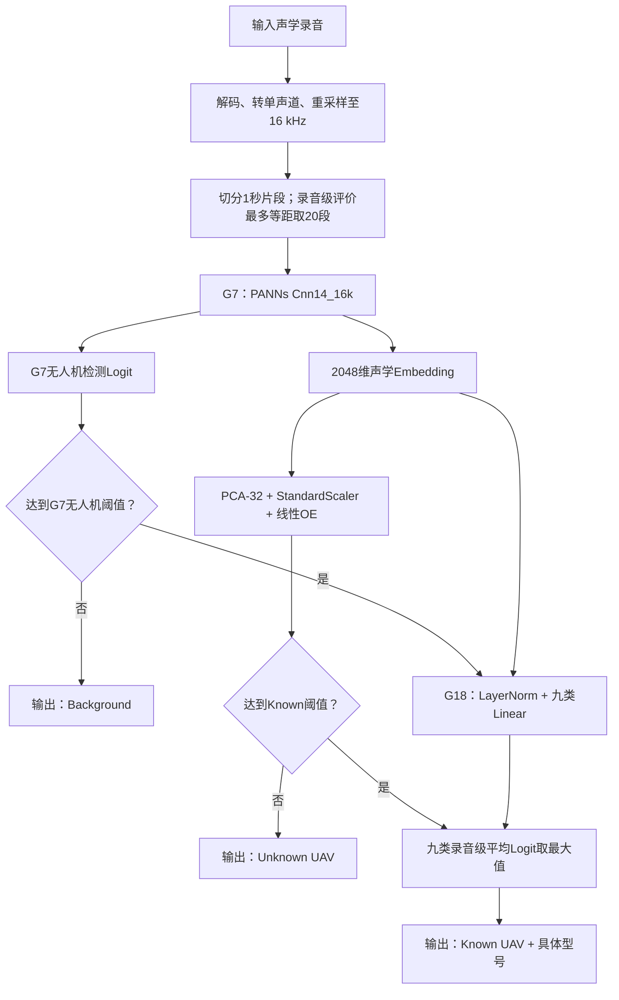
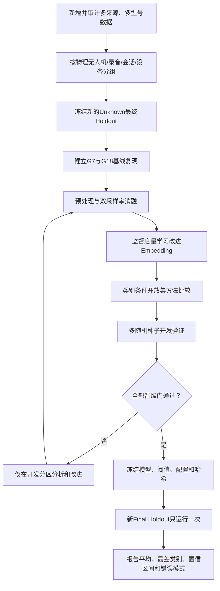

# 声学无人机检测与开放集型号识别系统
## 预训练模型、数据集、G7/G18模型与实验结果展示报告

更新日期：2026年7月27日  
适用对象：首次接触本工程的研究人员、项目评审人员、论文读者和工程开发人员

---

## 1. 报告目的

本报告独立介绍当前工程所采用的预训练模型、数据集、G7无人机检测模型、G18开放集
型号识别模型、训练/验证/测试流程、主要实验指标、现阶段困难和下一步可行方案。

工程当前正式名称为：

```text
声学无人机检测与开放集型号识别系统
Acoustic UAV Detection and Open-Set Model Identification
```

仓库目录仍保留历史名称`ABDDV-CRNN`，但当前正式检测器已经不是CRNN。当前主线为：

```text
AudioSet预训练PANNs
→ G7无人机/背景检测
→ G18九个已知型号分类
→ Known/Unknown开放集判断
→ 输出背景、未知无人机或具体已知型号
```

本报告只陈述已经由工程配置、冻结模型和实验产物支持的能力，不把尚未完成的设想写成
现有功能。

---

## 2. 一页结论

### 2.1 当前系统已经做到什么

1. G7在DADS内部测试集上的无人机/背景二分类F1达到`0.996992`，Recall达到
   `0.998567`。
2. G7在G18最终180条无人机录音上，严格模式和平衡模式的检测Recall均为`1.000000`。
3. 冻结G7后，只训练轻量G18型号头，九个已知型号在最终Known Holdout上的录音级
   闭集Accuracy三种子均值为`0.912088`，Macro-F1为`0.894214`。
4. 使用`MATRICE300/S900`开发Unknown判断时，Unknown Recall达到`0.944444`。

### 2.2 当前系统还没有做到什么

1. 在从未用于开发的`X6D/Y6`最终Unknown Holdout上，Unknown Recall只有
   `0.191011`。
2. 89条未知型号录音中有72条被错误接纳为已知型号，Unknown误接纳率为`0.808989`。
3. X6D的44条录音没有一条被正确拒识，且大部分X6D/Y6被归入`PHANTOM4`。
4. 因此当前系统能够较好完成“无人机检测”和“九个已知型号分类”，但不能宣称已经
   实现可靠的通用未知型号识别。

### 2.3 当前最准确的能力表述

> 当前系统已具备较好的声学无人机检测能力，并能在同设备、相近采集条件下识别九个
> 已知无人机型号；但对训练和开发阶段均未见的新型号，开放集拒识能力仍不可靠。

---

## 3. 系统解决的三个问题

当前系统不是用一个模型直接回答所有问题，而是把任务拆成三个层次。

| 层次 | 需要回答的问题 | 当前模块 |
|---|---|---|
| 第一层 | 声音中有没有无人机？ | G7二分类检测器 |
| 第二层 | 如果是无人机，它是否属于九个已知型号？ | G18开放集Known/Unknown分支 |
| 第三层 | 如果属于已知型号，具体是哪一个型号？ | G18九分类型号头 |

完整推理流程如下。



必须特别注意：

- G7只判断“无人机/背景”，不判断具体型号；
- G18只在G7认为存在无人机后负责型号层面的判断；
- G7检测到无人机，不等于已经证明它属于G18的九个已知型号；
- 一个新型号可能被G7正确检测为无人机，却被G18错误识别成某个已知型号。

---

## 4. 为什么采用预训练模型

### 4.1 从随机初始化训练的困难

无人机声学数据相对有限，而且不同录音设备、环境、距离、风噪、交通噪声和信噪比会
造成明显域差异。如果从随机权重开始训练，大模型需要仅靠无人机数据重新学习：

- 频谱边缘和谐波结构；
- 发动机、旋翼和机械周期声；
- 环境声与交通声；
- 瞬态、稳态和重复声学模式；
- 不同频段之间的组合关系。

这容易导致模型只适应训练数据来源，而无法适应新设备和新环境。

### 4.2 AudioSet预训练的作用

本工程采用官方AudioSet监督预训练的PANNs `Cnn14_16k`作为初始化。工程使用的检查点
输出维度对应527个AudioSet发布标签，已经从大规模通用声音事件中学习声学表征。

预训练带来的主要价值不是“提前认识所有无人机型号”，而是：

1. 提供已经形成的通用时频特征；
2. 降低仅依赖DADS从头学习声学表示的难度；
3. 让网络能够复用机械声、发动机声、环境声等相关知识；
4. 改善低误报区域和跨来源排序能力；
5. 为G18提供可复用的2048维声学Embedding。

### 4.3 预训练模型身份

| 项目 | 内容 |
|---|---|
| 模型 | PANNs `Cnn14_16k` |
| 预训练数据 | AudioSet |
| 预训练输出 | 527类 |
| 输入采样率 | 16 kHz |
| 官方检查点 | `Cnn14_16k_mAP=0.438.pth` |
| 官方检查点SHA256 | `e2ee543a27919542c2ea03eabaa70b24dcd4e6c8e05621de6b67a94e4c5058e6` |
| 迁移表征维度 | 2048 |

AudioSet不是本工程的无人机训练集或测试集，不能用它报告本工程的无人机识别准确率。
它只负责提供预训练初始化。

### 4.4 G7如何使用预训练权重

G7先加载完整AudioSet预训练网络，然后：

1. 保留声谱前端、卷积主干和2048维全连接层；
2. 删除原527类输出头；
3. 新建一个`2048 → 1`二分类线性头；
4. 使用DADS对卷积主干、2048维全连接层和二分类头进行全量微调。

因此，G7不是“冻结PANNs只训练最后一层”，而是以预训练权重为起点进行完整的下游
微调。

---

## 5. 使用的数据集及各自角色

不同数据集承担不同任务，不能把所有数据简单合并后再随机划分。

| 数据集/数据来源 | 主要内容 | 在工程中的用途 | 是否更新模型权重 |
|---|---|---|---|
| AudioSet预训练权重 | 通用声音事件知识 | 初始化PANNs | 作为G7训练起点 |
| DADS | 无人机/背景二分类音频 | G7训练、验证、内部测试 | 是，训练G7 |
| Kielce UAV数据 | 多个无人机物理编号和型号 | G18已知型号训练、Unknown开发和最终测试 | 部分用于训练G18/OE |
| val_ood Tune/Holdout | 多来源UAV、背景、多SNR条件 | G7阈值开发和OOD回归 | 否 |
| Unseen | DJI Mini 2、RED5 Eagle及背景 | 历史外部泛化评价 | 否，已消费 |
| Real-world | UAV、交通和直升机等背景 | 历史真实场景评价 | 否，已消费 |
| G13外部确认集 | DDL真实UAV、MINI、PRO4、航空器与城市背景 | G7/G12一次性外部确认 | 否，已封存 |

### 5.1 DADS：G7的监督训练数据

DADS原始数据位于39个Parquet文件中，每行保存WAV音频字节和二分类标签。G7正式实验
使用全部可用数据，不是早期工程中的“每类5000条”子集。

| 划分 | 背景片段 | UAV片段 | 总片段 | 独立`source_path` |
|---|---:|---:|---:|---:|
| Train | 87,974 | 124,528 | 212,502 | 126,224 |
| Validation | 18,670 | 27,943 | 46,613 | 27,048 |
| Test | 18,670 | 27,221 | 45,891 | 27,048 |
| 总计 | 125,314 | 179,692 | 305,006 | 180,320 |

划分比例为`70%/15%/15%`。训练、验证、测试之间的`source_path`交集为0。

G14后续更严格的原始音频哈希审计发现244个重复片段，约占历史清单的`0.08%`。
去重后的DADS dedup v2总计304,762片段，但正式G7尚未在dedup v2上重新训练。因此，
论文级严格复现仍应补充去重数据上的多随机种子实验。

### 5.2 Kielce：G18的型号数据

Kielce数据用于型号任务，不用于重新训练G7。当前G18将型号分成三组。

#### 九个Known型号

1. MAVIC2PRO
2. MAVIC2ZOOM
3. MAVIC3
4. MAVICAIR2
5. MAVICAIR2S
6. MAVICMINI2
7. PHANTOM4
8. YUNEECH520
9. YUNEECH520ERTK

#### Unknown开发型号

- MATRICE300
- S900

#### Unknown最终留出型号

- X6D
- Y6

G18按原始录音SHA256划分，而不是把同一录音切成1秒后随机分配。同一原始录音产生的
所有片段只能属于一个分区。

| G18分区 | 1秒片段 | 原始录音 | 作用 |
|---|---:|---:|---|
| known_train | 8,080 | 404 | 训练九分类型号头 |
| known_tune | 1,820 | 91 | 早停、方法开发和Known评价 |
| known_holdout | 1,820 | 91 | 已知型号最终评价 |
| unknown_tune | 1,800 | 90 | Unknown方法选择与阈值校准 |
| unknown_holdout | 1,780 | 89 | 未知型号一次性最终评价 |

五个分区的原始录音SHA256交集均为0。

### 5.3 为什么必须区分Train、Validation/Tune和Test/Holdout

| 分区 | 模型是否学习该数据 | 是否用于选择参数/阈值 | 结果用途 |
|---|---|---|---|
| Train | 是 | 是 | 学习模型参数 |
| Validation/Tune | 否 | 是 | 早停、选方法、定阈值 |
| Test/Holdout | 否 | 否 | 冻结方案后的最终评价 |

如果根据最终测试结果重新调阈值、换方法或选择表现最好的随机种子，测试集就会变成开发
集，最终结果将不再无偏。G18的X6D/Y6已经在P6中使用，因此后续可以用于错误分析或
新一轮开发，但不能再次作为“全新最终测试集”。

### 5.4 数据格式与预处理差异

G7和G18最终都向PANNs提供16 kHz、单声道、float32波形，但两条数据路径并不完全相同。

```text
G7 / DADS：
Parquet中的WAV字节
→ PCM解码
→ 多声道平均
→ 16 kHz重采样
→ 1秒固定长度
→ 峰值归一化
→ 训练增强

G18 / Kielce：
ZIP中的原始WAV
→ PCM解码
→ 多声道平均
→ 16 kHz重采样
→ 非重叠1秒切段
→ 每条录音最多等距选20段
→ 读取审计缓存，不再次峰值归一化或增强
```

G7训练与G18输入的归一化差异可能造成尺度域偏移，是后续需要受控消融的风险之一。

---

## 6. G7无人机检测模型

### 6.1 G7负责什么

G7执行二分类：

```text
0 = 背景/非无人机
1 = 无人机
```

它不输出Mavic、Phantom或Yuneec等具体型号。

### 6.2 G7模型结构


| 参数 | 设置 |
|---|---:|
| 输入 | 1秒、16 kHz、单声道 |
| STFT窗/FFT | 512点，约32 ms |
| 帧移 | 160点，10 ms |
| Mel频带 | 64 |
| 频率范围 | 50–8,000 Hz |
| 卷积块 | 6个双卷积块，共12层卷积 |
| 迁移Embedding | 2048维 |
| 总参数 | 79,955,457 |
| 正式随机种子 | 42 |

STFT、Log-Mel和首个归一化层强制使用FP32，后续CNN允许AMP。这样可避免旧版
`torchlibrosa`在FP16计算强频谱能量时溢出并产生NaN。

### 6.3 G7训练设置

| 项目 | 设置 |
|---|---|
| 训练数据 | DADS Train |
| 损失函数 | `BCEWithLogitsLoss` |
| 正类权重 | `87,974 / 124,528 ≈ 0.7065` |
| 优化器 | Adam |
| 初始学习率 | `1e-4` |
| 学习率衰减 | 每轮乘`0.75` |
| Batch size | 128 |
| 最大Epoch | 15 |
| Early stopping patience | 4 |
| 模型选择指标 | Validation F1，阈值0.5 |
| 混合精度 | CNN使用AMP，声学前端FP32 |

G7只对训练集执行波形增强：

- UAV以70%概率与训练背景混合；
- 混合SNR为`-5/0/+5/+10 dB`；
- 频率响应扰动概率0.50；
- 混响概率0.30；
- 有色噪声概率0.30；
- 最大100 ms时间平移概率0.50。

### 6.4 G7训练、验证和内部测试结果

最佳模型来自第7轮，第11轮触发早停，总训练时间约47.9分钟。

| 指标 | Validation | Test |
|---|---:|---:|
| Accuracy | 0.996289 | 0.996426 |
| Balanced Accuracy | 0.995731 | 0.995936 |
| Precision | 0.995291 | 0.995422 |
| Recall | 0.998533 | 0.998567 |
| Specificity | 0.992930 | 0.993305 |
| FPR | 0.007070 | 0.006695 |
| F1 | 0.996909 | 0.996992 |
| ROC-AUC | 0.999849 | 0.999854 |
| PR-AUC | 0.999916 | 0.999913 |

Test在阈值0.5下的混淆矩阵：

| 真实类别 | 预测背景 | 预测UAV |
|---|---:|---:|
| 背景 | 18,545 | 125 |
| UAV | 39 | 27,182 |

在45,891个测试片段中共有164个错误。DADS内部性能已经接近饱和，后续继续追求内部F1
的小幅提高，研究价值低于提升跨来源和低信噪比泛化。

### 6.5 G7外部泛化结果

| 数据 | ROC-AUC | PR-AUC | 标准化pAUC，FPR≤0.05 |
|---|---:|---:|---:|
| DADS Test | 0.999854 | 0.999913 | 0.999378 |
| val_ood Holdout | 0.791617 | 0.778131 | 0.575142 |
| Unseen | 0.729929 | 0.768605 | 0.625960 |
| Real-world | 0.998685 | 0.998745 | 0.988908 |
| G13外部确认 | 0.917455 | 0.683644 | 0.750827 |

G13一次性外部确认的冻结结果：

| 指标 | G7 |
|---|---:|
| F1 | 0.6165 |
| Recall | 55.0854% |
| Specificity | 97.4361% |
| FPR | 2.5639% |
| ROC-AUC | 0.9175 |
| PR-AUC | 0.6836 |
| 最差UAV来源TPR | 11.7241% |
| 最差背景来源Specificity | 57.7320% |

内部测试很高、外部来源下降明显，说明模型学习到了有效无人机声学特征，但仍受到设备、
环境、信噪比和来源差异影响。

### 6.6 Kielce UAV在冻结G7下的检测结果

Kielce不仅用于G18型号识别，工程也保存了冻结G7对Kielce无人机正类的检测结果。
此前容易遗漏这一部分，是因为G18报告的主要任务口径是“已知输入为无人机后的型号
识别”，G7结果被放在完整链路诊断字段中，而没有作为独立二分类实验表展示。

#### 6.6.1 Kielce Tune片段级开发结果

G15开发阶段在固定的4,096条G14 Tune子集上评估冻结G7，其中包括：

- Kielce UAV正类片段：2,048条；
- TAU城市背景负类片段：2,048条；
- G7阈值：0.5；
- Kielce与训练分区的原始音频哈希交集为0。

冻结G7结果为：

| 真实来源 | 样本数 | 检测正确 | 检测错误 | 指标 |
|---|---:|---:|---:|---:|
| Kielce UAV | 2,048 | 2,027 | 21 | Recall/TPR `0.989746` |
| TAU背景 | 2,048 | 2,026 | 22 | Specificity `0.989258` |
| 合并评价 | 4,096 | 4,053 | 43 | F1 `0.989505` |

合并评价的其他指标为：

| Accuracy | Balanced Accuracy | Precision | FPR | ROC-AUC | PR-AUC |
|---:|---:|---:|---:|---:|---:|
| 0.989502 | 0.989502 | 0.989263 | 0.010742 | 0.999055 | 0.999243 |

这组结果说明冻结G7在该Kielce Tune片段子集上能够检出约98.97%的无人机片段。不过它
属于已经参与开发比较的Tune结果，不是全新的最终测试结果；合并F1、Specificity和
FPR还同时依赖TAU背景，不能解释成仅由Kielce计算。

#### 6.6.2 G18 P6 Kielce录音级最终检测结果

P6对Kielce的91条Known Holdout录音和89条Unknown Holdout录音执行了冻结G7诊断：

| Kielce P6分区 | 录音数 | 严格模式检出 | 严格Recall | 平衡模式检出 | 平衡Recall |
|---|---:|---:|---:|---:|---:|
| 九个Known型号 | 91 | 91 | 1.000000 | 91 | 1.000000 |
| Unknown X6D/Y6 | 89 | 89 | 1.000000 | 89 | 1.000000 |
| 合计 | 180 | 180 | 1.000000 | 180 | 1.000000 |

录音级G7概率的计算方式为：

```text
每个1秒片段产生G7 Logit
→ 同一录音的片段Logit求平均
→ 使用温度2.2583125进行缩放
→ Sigmoid得到录音级无人机概率
```

两种冻结工作点为：

| 工作模式 | G7录音级阈值 |
|---|---:|
| 严格低误报模式 | 0.723640 |
| 平衡模式 | 0.508533 |

因为所有180条录音都超过更高的严格阈值，所以平衡模式同样全部检出。

#### 6.6.3 P6各型号在G7下的录音级结果

| 型号 | 录音数 | 严格模式检出 | Recall | 最低G7概率 | 平均G7概率 |
|---|---:|---:|---:|---:|---:|
| MAVIC2PRO | 14 | 14 | 1.000000 | 0.875246 | 0.966316 |
| MAVIC2ZOOM | 7 | 7 | 1.000000 | 0.953415 | 0.980448 |
| MAVIC3 | 14 | 14 | 1.000000 | 0.945215 | 0.990046 |
| MAVICAIR2 | 7 | 7 | 1.000000 | 0.931364 | 0.956193 |
| MAVICAIR2S | 7 | 7 | 1.000000 | 0.909315 | 0.974660 |
| MAVICMINI2 | 14 | 14 | 1.000000 | 0.827494 | 0.957796 |
| PHANTOM4 | 14 | 14 | 1.000000 | 0.962483 | 0.992104 |
| YUNEECH520 | 7 | 7 | 1.000000 | 0.995031 | 0.998132 |
| YUNEECH520ERTK | 7 | 7 | 1.000000 | 0.993179 | 0.996908 |
| X6D | 44 | 44 | 1.000000 | 0.794821 | 0.967963 |
| Y6 | 45 | 45 | 1.000000 | 0.928029 | 0.966855 |

这张表证明：

1. P6包含的九个Known型号都能被G7检测为无人机；
2. X6D和Y6也都能被G7检测为无人机；
3. G7能够检测X6D/Y6，不代表G18能够把它们正确拒识为Unknown；
4. P6中Unknown识别失败发生在G18，而不是G7漏检。

#### 6.6.4 这些结果不能说明什么

P6 Kielce Holdout全部是无人机正类，没有背景样本，因此不能从该分区计算：

- Accuracy；
- Specificity；
- FPR；
- Precision；
- F1；
- ROC-AUC或PR-AUC。

P6的`Recall=1.0`只能说明当前180条Kielce录音全部被G7检测到，不能单独证明G7在
Kielce采集环境下具有低误报能力。若要形成完整的“Kielce域G7二分类最终实验”，必须
另外引入与Kielce录音设备、地点和时间匹配、且未参与开发的背景录音，并在冻结阈值下
一次性评价。

---

## 7. G18已知型号分类与开放集识别

### 7.1 为什么在G7之后增加G18

G7的训练标签只有“无人机/背景”，没有九个型号标签。因此G7只能判断一段声音是否像
无人机，无法说明它属于哪个具体型号。

G18复用G7的2048维Embedding，原因是G7已经学习了较强的无人机声学表示。与重新训练
一个完整大模型相比，冻结G7并训练轻量型号头具有以下优点：

- 保护已经验证的G7检测能力；
- 减少小型型号数据集上的过拟合风险；
- 可训练参数少，训练成本低；
- 可以直接检验G7特征中是否包含型号信息；
- G7和G18的职责清晰，便于审计。

### 7.2 G18九分类型号头

```text
冻结G7
→ 2048维Embedding
→ LayerNorm
→ Linear（2048→9）
→ 片段级九类Logit
→ 同一录音多个片段Logit求平均
→ 录音级具体型号
```

| 项目 | 数值 |
|---|---:|
| G7冻结参数 | 79,955,457 |
| G18可训练参数 | 22,537 |
| Batch size | 128 |
| 最大Epoch | 25 |
| Early stopping patience | 5 |
| 学习率 | 0.001 |
| Weight decay | 0.0001 |
| Label smoothing | 0.05 |
| 梯度裁剪 | 5.0 |

P1真实GPU预检证明：训练参数梯度有限，冻结G7没有梯度，训练路径和显存使用正常。

### 7.3 为什么采用录音级聚合

单个1秒片段可能只包含弱旋翼声、瞬时噪声或不完整的周期结构。多个片段的Logit平均
可以削弱偶然噪声，保留稳定的型号证据。

P2 seed 42结果：

| 评价单位 | Accuracy | Macro-F1 | 最低类别Recall |
|---|---:|---:|---:|
| 1秒片段级 | 0.679670 | 0.648224 | 0.457143 |
| 原始录音级 | 0.978022 | 0.979675 | 0.857143 |

因此“录音级约97%”不能解释为任意1秒窗口也有97%的型号准确率。当前型号识别明显依赖
多片段聚合。

### 7.4 G18开放集Known/Unknown分支

普通九分类器无论输入什么，都会在九个类别中选择一个最大值。即使输入X6D，它也可能
高置信度输出PHANTOM4。因此还需要一个独立分支判断输入是否属于Known集合。

最终进入多随机种子实验的方法为：

```text
录音级2048维Embedding
→ PCA降至32维
→ StandardScaler
→ 类别平衡Logistic Regression
→ Known概率
→ 与冻结阈值比较
```

Outlier Exposure（OE）的含义是：在开发阶段显式提供Known和一部分Unknown样本，让
分类器学习两者边界。本工程OE只见过`MATRICE300/S900`：

- 每个Unknown型号45条录音；
- 每型号27条用于OE拟合；
- 每型号18条用于阈值校准；
- 阈值选择要求Known接纳率至少约90%。

---

## 8. G18从P0到P6的完整实验路线

| 阶段 | 目标 | 主要结果 | 决策 |
|---|---|---|---|
| P0 | 建立开放集数据注册表 | 五个分区原始录音哈希交集为0 | 通过 |
| P1 | 冻结G7的型号头GPU预检 | 22,537个参数可训练，梯度有限 | 通过 |
| P2 | seed 42已知型号可行性 | 录音级Macro-F1 `0.979675` | 通过 |
| P3 | MSP直接拒识Unknown | Unknown Recall `0.177778` | 停止 |
| P3b | PCA余弦类原型 | Unknown Recall `0.388889`，闭集性能严重下降 | 停止 |
| P3c | PCA-32类条件kNN-5 | Unknown Recall `0.400000` | 停止 |
| P3d | PCA+线性OE | Unknown Recall `0.944444` | 进入多种子 |
| P4 | seeds 43/44复现型号头 | 录音级Macro-F1均值`0.966916` | 通过 |
| P5 | 三种子固定OE复现 | 开放集Bal.Acc `0.966728` | 冻结最终协议 |
| P6 | X6D/Y6一次性最终测试 | Unknown Recall `0.191011` | Holdout关闭，泛化失败 |

### 8.1 Unknown候选方法对比

| 方法 | Known接纳率 | Unknown Recall | Bal.Acc | AUROC | Known闭集Acc | Known端到端Acc |
|---|---:|---:|---:|---:|---:|---:|
| MSP | 0.901099 | 0.177778 | 0.539438 | 0.627717 | 0.978022 | 0.901099 |
| PCA余弦原型 | 0.901099 | 0.388889 | 0.644994 | 0.677778 | 0.472527 | 0.450549 |
| PCA类条件kNN-5 | 0.923077 | 0.400000 | 0.661538 | 0.739683 | 0.978022 | 0.901099 |
| PCA+线性OE | 0.989011 | 0.944444 | 0.966728 | 0.991453 | 0.978022 | 0.967033 |

MSP失败的原因是Unknown也可能获得很高的最大Softmax概率；余弦原型虽然提高拒识率，
却破坏了原有型号分类；kNN保留了闭集性能，但Unknown Recall仍不足。线性OE是开发集
上第一个同时保留Known分类并显著提高Unknown拒识的方法。

### 8.2 P4已知型号多随机种子验证

| Seed | 最优轮次 | 录音级Accuracy | 录音级Macro-F1 | 最低Recall |
|---:|---:|---:|---:|---:|
| 42 | 25 | 0.978022 | 0.979675 | 0.857143 |
| 43 | 13 | 0.956044 | 0.957272 | 0.857143 |
| 44 | 19 | 0.967033 | 0.963802 | 0.857143 |
| 均值 | — | 0.967033 | 0.966916 | 0.857143 |
| 样本标准差 | — | 0.010989 | 0.011522 | 0.000000 |

这表明同一开发分布上的已知型号分类对随机种子相对稳定。

### 8.3 P5 Unknown开发集多随机种子结果

| Seed | Known接纳率 | Unknown Recall | Bal.Acc | AUROC | 闭集Acc | 型号端到端Acc |
|---:|---:|---:|---:|---:|---:|---:|
| 42 | 0.989011 | 0.944444 | 0.966728 | 0.991453 | 0.978022 | 0.967033 |
| 43 | 0.989011 | 0.944444 | 0.966728 | 0.991148 | 0.956044 | 0.945055 |
| 44 | 0.989011 | 0.944444 | 0.966728 | 0.991453 | 0.967033 | 0.956044 |
| 均值 | 0.989011 | 0.944444 | 0.966728 | 0.991351 | 0.967033 | 0.956044 |

三种子在MATRICE300/S900上的Unknown Recall完全相同。这只能说明方法在相同Unknown
开发分布上稳定，不能证明它能拒识任意新型号。

### 8.4 P6一次性最终Holdout结果

最终测试使用：

- Known Holdout：91条录音；
- Unknown Holdout：89条录音；
- Unknown型号：X6D 44条、Y6 45条；
- seeds 42、43、44；
- 不选择seed、不搜索阈值、不修改方法。

| Seed | Known接纳率 | Unknown Recall | Bal.Acc | AUROC | Known闭集Acc | Macro-F1 | 型号端到端Acc |
|---:|---:|---:|---:|---:|---:|---:|---:|
| 42 | 0.967033 | 0.191011 | 0.579022 | 0.789851 | 0.923077 | 0.907291 | 0.890110 |
| 43 | 0.967033 | 0.191011 | 0.579022 | 0.785282 | 0.912088 | 0.900207 | 0.879121 |
| 44 | 0.967033 | 0.191011 | 0.579022 | 0.782936 | 0.901099 | 0.875145 | 0.868132 |
| 均值 | 0.967033 | 0.191011 | 0.579022 | 0.786023 | 0.912088 | 0.894214 | 0.879121 |

开发集到最终集的变化：

| 指标 | P5开发集 | P6最终集 | 绝对变化 |
|---|---:|---:|---:|
| Known接纳率 | 0.989011 | 0.967033 | -0.021978 |
| Unknown Recall | 0.944444 | 0.191011 | -0.753433 |
| 开放集Bal.Acc | 0.966728 | 0.579022 | -0.387706 |
| Known/Unknown AUROC | 0.991351 | 0.786023 | -0.205328 |
| Known闭集Accuracy | 0.967033 | 0.912088 | -0.054945 |
| 型号端到端Accuracy | 0.956044 | 0.879121 | -0.076923 |

Unknown分型号结果：

| Unknown型号 | 录音数 | 正确拒识 | Recall |
|---|---:|---:|---:|
| X6D | 44 | 0 | 0.000000 |
| Y6 | 45 | 17 | 0.377778 |
| 合计 | 89 | 17 | 0.191011 |

### 8.5 G7和G18在P6中的关系

G7在严格阈值和平衡阈值下都检测到了全部180条最终Holdout无人机录音：

```text
G7 UAV Recall = 180 / 180 = 1.000000
```

这能证明这些录音在当前协议下被G7判为无人机，但不能证明它们属于G18九个Known
型号。Known与Unknown是由数据注册表中的型号身份定义，再由G18尝试判断。

P6的主要失败发生在G18：

```text
G7：正确判断X6D/Y6是无人机
G18：大量把X6D/Y6错误接纳为Known
九分类头：大部分进一步预测为PHANTOM4
```

因此最终未知数据的典型情况确实是“可以被识别为无人机，但具体型号判断不可靠”。
当前系统也不能稳定地把它们标记为Unknown。

---

## 9. 当前面临的核心难题

### 9.1 Unknown开发覆盖不足

线性OE只见过MATRICE300和S900。它学习的是：

```text
九个Known型号 vs MATRICE300/S900
```

而不是所有可能的未知无人机。X6D/Y6与开发Unknown不同，导致边界失效。

### 9.2 Unknown向PHANTOM4区域坍缩

P6中：

- X6D在三个种子中均有43/44条闭集预测为PHANTOM4；
- Y6有44～45/45条闭集预测为PHANTOM4；
- X6D的Known概率中位数约0.81～0.82；
- 冻结阈值只有约0.335～0.348。

这些样本不是“略高于阈值”，而是被高置信度认为接近Known。因此轻微调整阈值不能
解决问题，并且会明显降低Known接纳率。

### 9.3 G7特征的优化目标与型号任务不同

G7通过“无人机/背景”标签学习表示。对G7来说，只要X6D、Y6和PHANTOM4都表现出无人机
声学特征，它们靠得较近并不违反G7训练目标。但G18需要进一步区分型号和未知边界，
仅冻结G7特征加线性头可能不足。

### 9.4 全局线性开放集边界表达能力有限

PCA-32加逻辑回归只学习一个全局线性Known/Unknown边界，难以表达：

- 某个Unknown靠近PHANTOM4但远离其他Known；
- 不同Known类别具有不同方差和边界半径；
- 类内存在多种飞行状态、距离和转速模式；
- Unknown可能落在Known类别之间或类内高密度区域。

### 9.5 设备与采集条件单一

G18数据使用同一录音设备`OLYMPUS LS11`，多数型号来自有限采集会话。模型可能同时
学习到设备频响、采集地点、距离或会话线索。当前结果不能证明跨设备、跨城市、跨季节、
跨距离和跨强噪声条件稳定。

### 9.6 片段级识别能力仍有限

P2中片段级Accuracy只有`0.679670`，明显低于录音级`0.978022`。这意味着：

- 实时首个1秒窗口的型号输出不够可靠；
- 当前高性能依赖最长20个分散片段的聚合；
- 离线录音级结果不能直接当作低延迟在线识别性能。

### 9.7 G7外部泛化与低SNR仍不足

G13中G7 Recall只有55.09%，最差UAV来源TPR只有11.72%。训练增强最低只覆盖到
`-5 dB`，对`-10/-15 dB`条件的能力仍不足。

### 9.8 数据预处理可能引入域偏移

- 多通道直接平均可能产生相位抵消；
- 16 kHz重采样会舍弃8 kHz以上信息，而高频谐波可能有助于区分型号；
- 峰值归一化会削弱绝对响度和距离信息；
- G7训练波形归一化，而G18注册缓存不再次归一化；
- 不同数据源的麦克风、编码、采样率和增益可能成为捷径。

---

## 10. 下一步可采用的方案

下一阶段建议建立新的G19实验主线，不应继续在已经消费的P6上调阈值。

### 10.1 第一优先级：重建数据协议

1. 将X6D/Y6登记为已消费开发数据，可用于错误分析或新的OE训练。
2. 增加更多Unknown型号，尤其加入与PHANTOM4声学结构相似的机型。
3. 在训练前冻结至少两个全新Unknown型号作为新的最终Holdout。
4. 增加跨麦克风、跨地点、跨距离、跨天气、跨季节和多SNR录音。
5. 按物理无人机、原始录音、采集会话和设备分组划分，避免片段泄漏。
6. 保留原始音频、统一元数据、SHA256和许可证记录。

建议的数据分层为：

```text
Known Train
Known Tune
Known Holdout
Unknown OE Train：多型号、多结构
Unknown Calibration：与OE Train型号或实例隔离
Unknown Development Holdout：用于方法比较
Unknown Final Holdout：全新型号，只运行一次
```

### 10.2 第二优先级：学习适合型号区分的Embedding

不能只依赖G7的二分类Embedding。可以比较：

- 监督对比学习；
- Triplet Loss；
- Proxy-based metric learning；
- ArcFace或CosFace角度间隔分类；
- Center Loss与类内紧致约束；
- 分阶段解冻G7高层卷积块；
- 录音级多片段联合训练。

目标是让同一型号更紧凑、不同型号间隔更大，同时保留G7无人机检测能力。

### 10.3 第三优先级：类别条件开放集建模

优先比较：

1. 每个Known类别独立的Mahalanobis距离；
2. 类别条件kNN或局部密度；
3. Energy-based开放集分数；
4. OpenMax；
5. EVT尾部分布建模；
6. 多原型类别表示；
7. 分类分数、距离分数和G7检测分数的安全后融合。

与一个全局Known/Unknown线性边界相比，类别条件方法更适合处理“X6D接近PHANTOM4”
这种局部错误。

### 10.4 第四优先级：双采样率与高频信息

当前16 kHz输入最高只保留8 kHz。可在不替代G7的前提下增加48 kHz高频分支：

```text
16 kHz G7稳定低频/中频表示
        +
48 kHz高频谐波和旋翼细节表示
        ↓
录音级后期融合
```

必须做受控消融，证明提升来自高频信息，而不是设备或数据来源捷径。

### 10.5 第五优先级：受控预处理消融

至少比较：

| 消融项 | 需要回答的问题 |
|---|---|
| 峰值归一化 vs 不归一化 | 绝对响度信息是否有用，是否造成域不一致 |
| 单通道选择 vs 通道平均 | 通道平均是否造成相位抵消 |
| 16 kHz vs 48 kHz | 高频信息是否提升型号和Unknown识别 |
| 连续前20秒 vs 全长等距20段 | 离线结果能否迁移到在线早期决策 |
| 片段Logit平均 vs 注意力聚合 | 是否能自动选择高质量片段 |

### 10.6 第六优先级：提升G7跨来源检测

G7下一步不应主要优化DADS内部F1，而应优化：

- `TPR@1% FPR`与`TPR@5% FPR`；
- 低FPR partial AUC；
- 最差来源TPR；
- `-15/-10 dB`低SNR Recall；
- 跨设备和跨背景稳定性；
- 每小时误报次数。

可采用多来源域泛化、困难背景负样本、麦克风响应增强、SNR课程学习和来源均衡采样，
但必须设置内部性能和背景FPR保护门。

### 10.7 建议的下一代晋级门

新模型进入最终测试前，建议同时满足：

```text
Known闭集Macro-F1多种子稳定
Known接纳率达到预设保护线
多Unknown型号平均Recall达到门槛
最差Unknown型号Recall达到门槛
错误不集中坍缩到单一Known型号
跨设备或跨会话开发验证通过
G7固定FPR检测能力不退化
```

不能只看Unknown总体平均值。像X6D Recall为0的情况必须由“最差Unknown型号Recall”
强制门槛捕获。

---

## 11. 推荐的实验执行顺序



推荐先解决数据覆盖和评价协议，再比较复杂算法。否则更复杂的模型仍可能只记住少量
Unknown开发型号。

---

## 12. 汇报时应如何表述结果

### 12.1 可以表述

- G7在DADS内部测试集上的F1为`0.996992`。
- G7对G18最终180条无人机录音的检测Recall为`1.000000`。
- 九个Known型号在最终同域Holdout上的录音级闭集Accuracy约为`91.21%`。
- 当前线性OE在MATRICE300/S900开发集上的Unknown Recall为`94.44%`。
- X6D/Y6最终Unknown Holdout上的Unknown Recall为`19.10%`，说明开放集泛化失败。

### 12.2 不应表述

- “G7能够识别九个具体型号。”
- “G7检测到无人机，就说明它属于G18的Known集合。”
- “当前系统可以可靠识别任意未知无人机。”
- “开发集94.44%的Unknown Recall代表真实开放世界性能。”
- “P6后重新调阈值得到的结果仍是无偏最终测试结果。”
- “录音级91.21%的型号准确率等于任意1秒实时窗口的准确率。”

---

## 13. 最终总结

当前工程已经完成从通用声学预训练、无人机二分类检测，到已知型号分类和开放集Unknown
判断的完整实验链路，并建立了数据哈希隔离、阈值冻结、多随机种子复现和一次性最终
Holdout协议。

G7的主要价值是利用AudioSet预训练PANNs和DADS全量微调，形成较强的无人机/背景检测
器和2048维声学表征。G18证明了这些表征中包含较强的型号信息：九个Known型号在最终
同域录音级测试中仍能达到约91.2%的闭集Accuracy。

但开放集问题仍未解决。线性OE在MATRICE300/S900上取得94.44%的Unknown Recall，
到了全新的X6D/Y6后下降到19.10%，并大量坍缩为PHANTOM4。这个结果说明，当前最需要
改进的不是DADS内部F1，也不是在P6上继续调阈值，而是：

```text
扩大Unknown型号和采集域覆盖
→ 学习更适合型号区分的Embedding
→ 使用类别条件开放集边界
→ 建立新的未消费最终Holdout
→ 进行一次性冻结评价
```

在完成这些工作前，系统最合适的工程输出仍是：

```text
Background
Known型号候选 + 置信度
Unknown/需要人工复核
```

其中Unknown提示应被视为实验性结果，不能作为完全可靠的自动结论。

---

## 14. 工程依据与关键产物

主要参考文档：

- [G7模型结果与性能分析报告](G7模型结果与性能分析报告.md)
- [G18方法原理与完整流程说明](G18方法原理与完整流程说明.md)
- [G18实验结果综合汇总报告](G18实验结果综合汇总报告.md)
- [工程文件架构说明](../PROJECT_ARCHITECTURE.md)

关键配置：

```text
configs/g7_panns_cnn14_16k_pt.yaml
configs/g18_model_id_registry.yaml
configs/g18_model_id_seed42.yaml
configs/g18_multiseed_outlier_exposure.yaml
configs/g18_final_holdout.yaml
```

关键冻结身份：

| 产物 | SHA256 |
|---|---|
| G7 seed 42正式检查点 | `d357f194105ec27a61838e0f4c2e7575932e2dd861e529ef970b1fb467954cdc` |
| G18 P0注册审计 | `dfa788540dbeef4b39fd6c6562d902921af8976bb576e8565e7f25e8629229b9` |
| P5三种子开发汇总 | `fc9c80c7f67f5ec97b5117562460d27f0a688f2f71240fca139e1ed46bb8ff04` |
| P6最终汇总 | `1f201718e4d39f5ece483f7925561fa3412b9edceb9f2128873a99d4c3be2cf8` |

关键结果路径：

```text
artifacts_g7_panns_pt/runs/seed_42/best.pt
artifacts/g18_model_identification/p5_multiseed_outlier_exposure/
artifacts/g18_model_identification/p6_final_holdout_once/summary.json
artifacts/g18_model_identification/p6_final_holdout_once/seed_42_recording_predictions.csv
artifacts/g18_model_identification/p6_final_holdout_once/seed_43_recording_predictions.csv
artifacts/g18_model_identification/p6_final_holdout_once/seed_44_recording_predictions.csv
```
